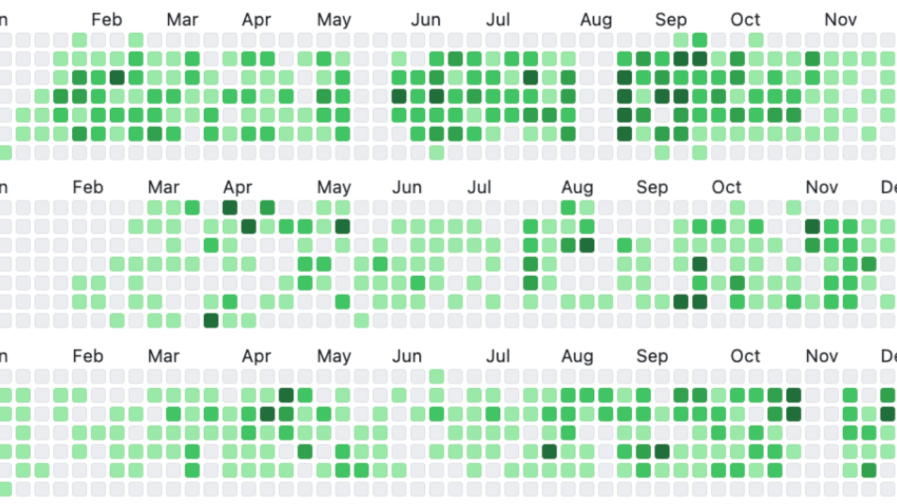
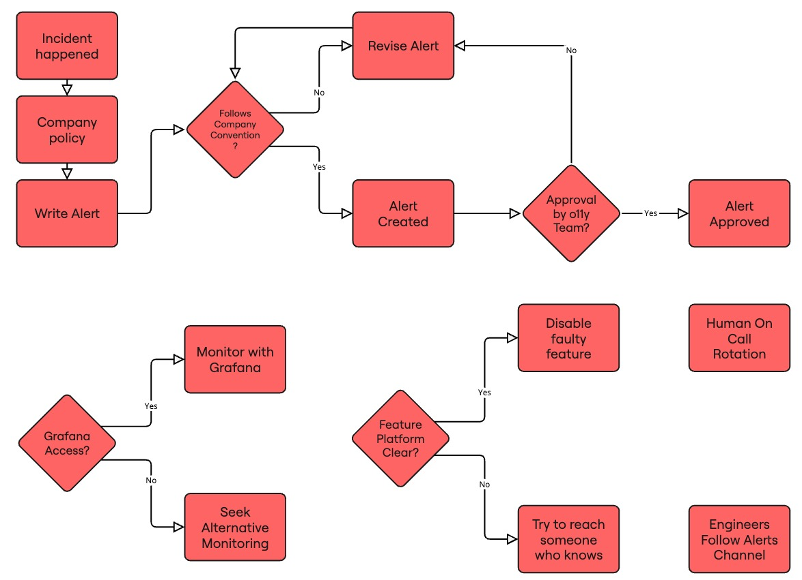
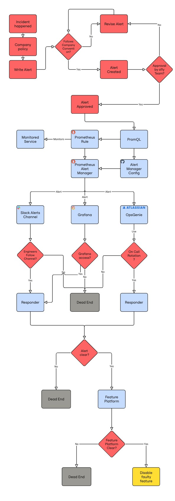

## Introduction

*Own collage, 1000 days of Github history in 2022, 2023, 2024*

I've been paid for writing software for 10 years, as of the past September. I wanted to take a moment to reflect on the most important things I've learned, as well as open it up to conversation. 

Now, 3652 days is a decent amount of time. Some of you probably have double or even triple that number of years invested in your craft. I invite you to also talk about your experiences, your lessons and failures - I'd love to hear or read about it. 

*[T meltzer](https://upload.wikimedia.org/wikipedia/commons/c/c6/Decagonal_Dome_of_St_Gereon%27s_Basilica%2C_Cologne.jpg), CC BY-SA 4.0 <https://creativecommons.org/licenses/by-sa/4.0>, via Wikimedia Commons*

In this presentation we'll talk about:
1. Beauty
2. Attaining Software Nirvana
3. Engineering Zen
4. Freud vs Clean Code

Many of the things I've learned are abstract ideas, but I've tried to include a fair share of practical advice. I hope you'll forgive me for not going too deep in my limited time — I want to give you concepts rather than solutions.

*[Raphael](https://commons.wikimedia.org/wiki/File:%22The_School_of_Athens%22_by_Raffaello_Sanzio_da_Urbino.jpg), Public domain, via Wikimedia Commons*

> "You won't build a successful system without understanding its parts, how they interact, and how you can change them."

This is the core message in this presentation. The rest of it will be me giving you examples of how I learned to do that, and how after 10 years, I'm still learning. Now let's get started. 

## Beauty

*[Sandro Botticelli](https://commons.wikimedia.org/wiki/File:Sandro_Botticelli_-_La_nascita_di_Venere_-_Google_Art_Project_-_edited.jpg), Public domain, via Wikimedia Commons*

This is an image some people connect with beauty. Classical art, Renaissance, Venus.

This was me in 2015. I was writing my thesis on a requirements editor for a domain specific language my supervisor created for space projects. This was all written in Java 6 and Swing. Now, if you're not familiar with it, Java Swing looks like this. 

In our first checkpoint meeting, the folks from ESA flew over to review our work. They liked the functionality, but hated the interface, and ordered us to rewrite it all on JavaFX which had much more modern look & feel. That was the first time that I learned that it doesn't matter how good the functionality of a thing you make is, if it doesn't look good enough, no one will bother. That's not a bug, that's a feature. That was a valuable lesson, and I'm grateful to have learnt it so early in my career.

But there was a more interesting lesson underneath that, which I didn't get at the time.

Who knows the painter or name of this painting?

This exhibit is a painting titled “View of the sea at Scheveningen” (Dutch people, I'm really sorry for butchering this!) and it was created by Vincent Van Gogh in 1882. This painting doesn’t just show the beach of Scheveningen, it actually contains it. You see, Vincent was painting on location at the beach, and the weather was indeed getting stormy, so the wind blew lots of sand into his painting. Vincent’s choice to paint on location, and the randomness of the weather, resulted in sand still being part of the painting today.

This gets us to Conway’s Law. It states that:

> “Any organisation that designs a system will produce a design whose structure is a copy of the organization's communication structure”

In other words, the way you function as a company, your priorities, concerns and internal politics will all be reflected in your company’s products and processes. If you paint on a beach, expect sand in your painting.

*Exit Through the Gift Shop. Image courtesy of Revolver Entertainment.*

Now I have to admit I lied to you before. This isn't a presentation about beauty, or nirvana, zen or Freud. This is a presentation about:

## Sales

Around 2015, I built the first version of a tool that would end up becoming my business. The tool was an inventory management system for hobby stores, with automated pricing as the killer feature. 

You can understand that for this random Greek 20 year old with a goatee to walk into a business in France or Poland and try to sell magic software that would autoprice hundreds of thousands of inventory items... that was a tough sell. So I learned to sell.

*Own work, promotional brochure, circa 2017*

I don't claim to be an expert salesman, but I was moderately successful. The most important sales skills I learned was “empathetic perception”. This is the ability to know what the people in the room see when they look at me, what they want, and tell them how my proposal can help them get it, if it can. Understand the system they are in, and help them succeed. 

I know this sounds a bit vague and I don't want to bore you with stories that may feel far away. So here's an example of this empathetic perception, applied on a work meeting I attended in 2023 at Miro:

.jpg)
*(Source: [Bill Branson (Photographer)](https://commons.wikimedia.org/wiki/File:Staff_meeting_(3).jpg), Public domain, via Wikimedia Commons)*

Imagine this scene. There's 6 people in a room, including me. The topic we are discussing is a proposal written by another engineer and I. We need a platform team to commit about 3 person months to help us. We are trying to build a system, but whether we will succeed or not, depends on our communication skills in this meeting.

Let's take a look at the people in the room:

Architect:
* Previously worked on a similar proposal which didn't go anywhere. 
	* I should be careful not to offend them and their ego and acknowledge those efforts, as well as involve them for input on stuff they've learned
	* They care about the problem, and would like to see a proper solution, that's why they're here
* Their presence adds weight to the meeting, it's not just a cross-team request

2 engineers from a platform team:
* We have worked together before, we have mutual respect
* I expect that they'll be alt-tabbed half of the meeting working on code, so not the highest engagement from them
* They will probably call out technical flaws they see ideally during the meeting, but if they're feeling pressed by the presence of the architect, they may just stay quiet or talk to their manager instead - I should make sure to note their body language and ask them if at any point they seem concerned

Engineering Manager from the platform team:
* this is the main client in the meeting. I am selling primarily to this person.
* Their job is to defend team capacity, as they are overloaded
	* So I need to show that we are serious: Docs, PoCs, clear commitments and expectations
	* I need to run the organisational gauntlet to request their capacity
* Manager is extremely conscious of ownership and maintenance, need to be crystal clear on those and negotiate appropriately

Fellow engineer from my team:
* Great engineer, wrote a lot of our research and proposals
* I know that I often talk a lot - I should sometimes shut up and leave space for this person in the meeting
* The person has a different technical background than the rest of the team we're selling to, so I need to show how our complementary skills will help us succeed

Me:
* I'm the newest one in the room, so I shouldn't sound too confident when discussing past work
* we're touching a very critical flow component, so I need to be visibly overprepared. I am selling this idea to everyone in the room. If I lose their trust, the project gets stuck on low prio forever.
	* So I'm bringing a meeting agenda
	* I'm bringing links to RFCs and research we've done
	* And I have a board with diagrams
* I also need to be aware: How do **they** expect an overprepared professional to look? I opted to go with:
	* a clean shave
	* a nice shirt
	* and somewhat serious attitude
	* I am a guy with colored hair who speaks very excitedly and tests infra in prod. This serious overprepared guy is clearly not my usual persona, but it is what I think will be effective in this project

#### Persona

Do note the word persona as well. People will first perceive you, then filter it through their biases and then process the words you're saying. You can lose or gain their attention before you even speak. Some of that, you can control. Do you wear a company hoodie or a shirt? Do you talk fast or slow? What words and gestures do you choose? What's your Zoom background? When do you choose to talk? Many engineers love to think that they bring their single whole self to work, but that's not true, your company has a code of conduct and you are already performing a work persona.

*[Leonardo da Vinci](https://commons.wikimedia.org/wiki/File:0_The_Vitruvian_Man_-_by_Leonardo_da_Vinci.jpg), Public domain, via Wikimedia Commons*

You can spend some time to prepare a work persona that fits what you want to achieve, and then use the desired traits of that persona as areas to improve on. You don't have to do this, but be at least conscious of the persona you are projecting. Be careful though: Unless you're an actor or a roleplayer, it's kinda hard to pull off personas that are radically different from your usual behaviors.

_-_Google_Art_Project_-_edited.jpg)
*[Pieter Brueghel the Elder](https://upload.wikimedia.org/wikipedia/commons/f/fc/Pieter_Bruegel_the_Elder_-_The_Tower_of_Babel_%28Vienna%29_-_Google_Art_Project_-_edited.jpg), Public domain, via Wikimedia Commons*

One last thing about sales, I promise, this is some excellent advice I've learnt from my father: Always add something extra to a proposal that the client can reject. This way you know and control exactly what they will negotiate on. For example, in a project proposal some years ago, I added a security review that the client would probably reject as unnecessary. This works in proposals as well as RFCs ;)

*Own photo of artwork which I think was titled "Holy Word". Cannot track down the original museum and artist sadly, I believe it was somewhere in Spain :/*

You might wonder at this point: Why is Alex telling us this stuff about beauty and sales meetings via stories? The answer is because humans are, in Terry Pratchet's words, "storytelling chimpanzees", and we've always communicated any meaningful concept from ethics to history to mathematics that way. The Odyssey is a story, and the Bible uses stories, and so does the Talmud or the Ramayana.

Businesses have learned this. Business love a good story, whether they're the underdog disrupting an industry or an established leader building chapter 3. A good story unites people, for example: "we are crazy enough to stare into a legacy Python abyss, and migrate the monolith releases. Wanna join us?". Like everything else, you need to understand your story, and learn to write it and sell it. 

But I'm afraid this isn't a presentation about sales either. Sales & stories are just tools we use to get stuff done. This is a presentation about...

Cast your vote now, what do you think this presentation is about?

## Meta-systems

Meta-systems are the systems responsible for designing and building other systems. 

*Own work, using a modified version of [this file by Ana.pullse](https://commons.wikimedia.org/wiki/File:Meta_face.jpg), Public domain, via Wikimedia Commons*

They are not to be confused with "Meta systems", which are systems responsible for selling all your personal data, as well as the genocide in Myanmar.

*[Piet Mondrian](https://commons.wikimedia.org/wiki/File:Piet_Mondriaan,_1930_-_Mondrian_Composition_II_in_Red,_Blue,_and_Yellow.jpg), Public domain, via Wikimedia Commons*

I started my career working on backend systems. It was a simple world honestly - you have clear system boundaries, and you have very solid foundations on testing, cicd, observability, architecture, the whole deal. Maybe I was also simpler back then, but it was pleasing in the same way that a Mondrian painting is orderly and aesthetic. Over time, as I had to actually deliver software to my clients, I got more into DevOps. When I started seeing the effort and process required to deliver software to production in bigger organisations, I went deeper into Site Reliability Engineering. 

*[Joan Miró, The Harlequin's Carnival](https://en.wikipedia.org/wiki/The_Harlequin%27s_Carnival "The Harlequin's Carnival"), oil painting at Albright-Knox Art Gallery, Buffalo, NY*

Needless to say, things looked different over there.

Over time, I started seeing that the system was more complex than software or hardware. That's when I started focusing more on people, how they work together, and how a company achieves its business objectives by temporarily aligning groups of expert humans and systems on shared goals.

It's kinda pointless to built the 10th Spring Boot app without stopping to think: Why are we building these apps? What goals are we achieving? What other ways do we have to get there?

Sooner or later when you're talking about systems you arrive at this word: Sociotechnical. Sociotechnical systems theory is a way to describe the interaction between people and technology in workplaces. 

Let me explain.

I promise I'm not gonna shift the topic again, that was the last time... I think.

#### Sociotechnical Systems Theory (in Practice)

<a href="https://commons.wikimedia.org/wiki/File:Chick_Quest.png">Irisblixten</a>, <a href="https://creativecommons.org/licenses/by-sa/4.0">CC BY-SA 4.0</a>, via Wikimedia Commons

Do you remember the 3d glasses that were somewhat popular around 2000?

They are called red-cyan stereoscopic glasses. They work by filtering out colour ranges so that your left and your right eye end up seeing slightly different pictures, both of which have partial depth information. When you look through both eyes, the image is overlaid and your brain perceives a more complex picture (the stereoscopic illusion) than the individual pictures.

<a href="https://commons.wikimedia.org/wiki/File:Hammer_anaglyph_(14656149338).jpg">Gabriel Rollenhagen</a>, <a href="https://creativecommons.org/licenses/by-sa/2.0">CC BY-SA 2.0</a>, via Wikimedia Commons

Let's say you have a picture like the above, which can be viewed with these red-cyan glasses. What if you want to improve it by making the hammer bigger? You don't have to be a stereoscopy expert to understand that changing only the red part or only the blue part of the picture will surely fail - you need to change both. 

Sounds too abstract? We can try it in practice.

This is a fairly typical modern alerting UML diagram. We are looking at this with only one eye, the technical one, so everything is blue. We see how the alert is routed, but we can't see if or why an alert was written, or if anyone will pick up the responder's phone. We can ship alerts to Grafana, but does anyone actually see them there? Notice also that there are no decisions or actions here, just an automated process.

Now let's turn on the other eye, the red one, and look at the social side of the same space:

This diagram maps some of the organisational aspects of alert creation, response and delivery. For example, alerts are created after incidents due to policy, and need approval by the observability team. Here's a fun fact based on the above diagram: If you piss off the observability team you will never be able to ship alerts. That's a technical outcome, based on social actions, just like the meeting we were describing before.

Speaking of actions, notice that the human side has a lot of them. One of the powerful features of humans is that they can generally adapt to unexpected scenarios, and are usually authorised to act accordingly. Most incidents are solved by humans taking actions.

*[Own work editing La princesa de Éboli Forgery - Unknown author](https://commons.wikimedia.org/wiki/File:La_princesa_de_%C3%89boli.jpg), Public domain, via Wikimedia Commons. I love this part in the data: Unknown date (not 16th century)*

When I see an engineer who only thinks and sees the technical side of a problem, I think of them like this.

In case you didn't know, even without red-cyan glasses human depth perception is based on having two points of reference, two eyes. Using a single eye, it's impossible to perceive depth. The world is a lot simpler if you see it that way, hell you can even build your surroundings to avoid depth. But reality has depth, so most of your assumptions end up wrong.

This is the depth of reality. This diagram maps a sociotechnical system that's more than the sum of its parts.

If we were to describe the diagram, in short:
1. Humans create an alert
2. Machines manage and deliver the alert
3. Humans have to be available to respond
4. Humans have to access, know and use technical systems to respond successfully

A few things stand out for me in the diagram above:
* Notice the terminal states highlighted in grey. These are fail states. Typically an operator arriving there is out of immediate options, besides escalating to an unknown other, if they exist and are reachable
* Notice the spectacular amount of wasted effort if our operator reaches the final step, the feature management service, and cannot use it
* Notice the mingling of social and technical actions. This system cannot reach a success state without the collaboration of humans and machines
* The moment when control passes from machine to human is quite important. In aviation, they call it “transfer of control” and in their field, this is often where the failures that kill people actually happen
*  Feature platform, which we will assume can disable the feature causing the alert

Equipped with the above, we are now able to perform "Joint optimisation", the design and improvement of both sides of a system to maximise our desired output. Some examples of joint optimisation questions that are meaningful in the alerting context are:

* How can we improve average time to understanding an issue?
* How can we improve average time to mitigation?

If you've worked on alerting and incidents these are extremely familiar questions. 

So, to all of you "purely technical" engineers out there: I'm not asking you to open your third eye, I'm asking you to stop closing your second one.

COMEDIC RELIEF, SHORT PAUSE

Okay, so I know this has been a lot of stuff already and I don't want this to feel like an all-hands so let's do a check in, are we still here? 

#### Sociotechnical Systems Theory (in Theory)

Okay, we went through a practical example, but let's check out some of the theory of Sociotechnical Systems, shall we? I promise this will be worth your time.

*Possibly photographed by or for E. C. DeWolfe, but possibly provided to him by the coal company or the locomotive manufacturer., Public domain, via [Wikimedia Commons](https://upload.wikimedia.org/wikipedia/commons/1/1a/Mammoth_Vein_Coal_Fig_8.jpg)*

Sociotechnical systems is a way to describe the interaction between people and technology in workplaces. The term was coined in UK in the early 1950s by Eric Trist, Ken Bamforth and Fred Emery. They mainly studied coal miners.

*[Edmund Beecher Wilson](https://commons.wikimedia.org/wiki/File:Wilson1900Fig2.jpg), Public domain, via Wikimedia Commons, this is from an onion btw*

Across the Atlantic, in 1951, Talcott Parsons then defined his four subsystems for the survival of a social system. Mr Parsons saw an organization as a living organism:

1. It has goals
2. It adapts
3. Its cells work together
4. It replaces cells

[Parsons Four subsystems for the survival of a social system](Parsons%20Four%20subsystems%20for%20the%20survival%20of%20a%20social%20system.md)

Of course, mr Parsons used a lot more words, but that's what he meant. Parsons is kinda interesting btw: he founded the sociological department at Harvard, but much of his early work was just translating Weber's work from German.

Ok, we can now understand the subsystems of a complex sociotechnical system. What's next?

For the next couple decades sociological studies of work took off as a field. About 25 years later, Albert Cherns outlines the [9 Principles of Sociotechnical Design](9%20Principles%20of%20Sociotechnical%20Design.md)

Let's take a look at a few bangers from that list:
* **Compatibility**. The process of design must be compatible with the objectives. For example, an oligarchic committee cannot and will not design an equitable participatory system
* **Minimal critical specification.** Identify what is absolutely essential, and specify no more than absolutely essential. Acknowledge that a system functions because people get the job done regardless of rules.
* **Multifunctionality**. Simple mechanisms rely on simple, replaceable parts. They are not easily adaptable. Complex organisms rely on the adaptability of components, whether human or machine.
* **Information flow**. Information systems should be designed to provide information in the first place to the point where action on the basis of it will be needed.
* **Human values**. The organization should strive to provide a high quality work outcome. That depends on, but also has to compromise with, the desires of humans to work in a humane way. 

With this, we can now see the common threads between good executions of these systems. We can also start to see how to improve them.

Finally, having built enough understanding, we're set up to deliver the killshot: 10 years later, environmental scientist Donella Meadows gives us the [Donella Meadows leverage points](../../Donella%20Meadows%20leverage%20points.md) to intervene in a system. These are the key points where you actions can have the most impact on a system.

At this point you're at the edge of your seat right? You're like "Alex, please, I need to know what Donella wrote as the top way to influence these complex, living sociotechnical systems".

We're gonna talk about a few of them here:
6: The structure of information flows (who does and does not have access to what kinds of information
4: The power to add, change, evolve, or self- organize system structure
3: The goals of the system
2: The mindset or paradigm out of which the system—its goals, structure,rules, delays, parameters—arises

Let's start with information.

#### 6: Information

This is one of the easiest ways to affect a system - just make sure information is collected, discovered, and shared.

In George Orwell's 1984, control of information, as well as the distortion of it is a key task for the authoritative state. George wrote that book inspired by his fear of communist regimes, but he did forget to mention his wife worked at the literal Ministry of Propaganda of Great Britain. 

Information is also the level at which journalism typically operates. It's fairly effective, in fact thanks to social media at a global scale this has become one of the most accessible leverage points.

Anyways, information flows! This is one of the parts of what Tanya Reilly called "Glue Work" [back in 2019](https://www.noidea.dog/glue). As a staff or glue engineer, you can and should ensure the correct information reaches those at the top or bottom at all times, but also you should look at where that information is shared and discussed, and in which ways, and who is missing from those spaces.

It's important to remember what Mr Cherns said about information flow: 
>provide information in the first place to the point where action on the basis of it will be needed.

He goes on to note that far too often systems just flow information to the top, assuming that leaders will need to action it. It's quite often the opposite - people who are holding the tools need and act on that information.

#### 4: (The power to) Change system structures

It takes billions of self-organising, dynamically evolving cells for you to process this presentation, and judge it as a solid B for boring. An organism as complex as a human only works because of the constant self-adaptation which starts at the cellular level.

It can be tempting to use your power to "just fix it", and change a system structure. Sometimes that works! But much of the time, the system would be better off if you empower the people working with it to change it themselves. Teach a person to fish and give them fishing tools, rather than selling them fish.

The best part is, you can do this with any level of power! You can self-organise! Okay the anarchists in the audience are definitely getting excited now, and honestly, they have a point.

A few days ago, some of you here attended an event called "Group Therapy" where we just chatted up about our weeks. That event was self-organised, and we have the power to make more events like it. That event also had the sideeffect of creating a new information flow channel, which as we discussed above is also important for change.

#### 3. Goals of the system

A few years ago, I was part of an overworked SRE team, dealing with about 2 incidents a week. The company was also working with some very skilled external SRE contractors. The C-Levels would ask them to build random PoCs, and they delivered. We would sometimes end up having to maintain these systems. Now we, the internal SRE team got mad at them for building solutions that were completely inconsistent with the rest of our production, and their configuration was often confusing to us. The contactors were frustrated at us because we tried to make them change a delivered system to adapt to our standards that were often different. There was lots of coldness and quite some conflict. The heart of the issue is that we had different goals: We were paid for keeping production running smoothly, and they were paid for creating novel projects fast.

*[Julian Herzog](https://commons.wikimedia.org/wiki/File:Red_Arrows_Formation_Duxford_Flying_Finale_2024_01.jpg) ([Website](https://julianherzog.com/)), CC BY 4.0 <https://creativecommons.org/licenses/by/4.0>, via Wikimedia Commons*

After nearly 4 months of this, the head of engineering took one person from each side, and made us work together on a major future project. With our goals now aligned, it was some of the best collaboration in my career. The contractor side would know already from the planning stage what would work and what wouldn't for our certifications and workflows. And from our side, when the contractors put fresh ideas on the table, we had the time and space to discuss and process them, and sometimes adopt them across our infrastructure before the new project would arrive.

*[Dudley](https://commons.wikimedia.org/wiki/File:A_campfire_in_the_mountains.jpg), Public domain, via Wikimedia Commons*

We're about to reach the final part of our journey. Let's do a recap of what we've said so far:
 * The product of a system is influenced by the communication in that system
 * Our systems are sociotechnical
 * Seeing only the technical aspects of a system removes depth information
 * A complex system is like a living organism that repairs itself
 * Simple systems can only do one thing, but complex systems adapt
* We've looked at some of the most effective ways to modify a system
	* Modifying information flows
	* Empowering agents to change system structures
	* Adjusting the goals of the system

All in all, the most important thing I've learned in my career is how to understand and interact with the sociotechnical systems around me to get the world or the business where I think it needs to go.

Ok, I have to tell you right now, I'm not gonna tell you what's Donella's number 1 leverage point because it's a bit too unattainable and abstract. So let's look at number 2, which is the highest you can reasonably get.

#### 2. Paradigm shift

In Donella's words the leverage point is:

> The mindset or paradigm out of which the system—its goals, structure,rules, delays, parameters—arises

If you can switch the paradigm of a system, massive change follows. Think of the invention of math, computers, or croissants.

At the personal level this cultural change can come instantly. At the social level, it can be very hard. Let me quote Donella again: 

> Societal responses to paradigm challenge have included crucifixions, burnings at the stake, concentration camps, and nuclear arsenals

Jeff Bezos said that "Culture eats strategy for breakfast". If an organisation was built on the premise of "move fast and break things", well, it's really hard to make it move slow and carefully, no matter how many OKRs you set.

So how do you change a paradigm? Without the burnings and nuclear arsenal hopefully.

Donella says that you should " keeppointing at the anomalies and failures in the old paradigm,  keep speaking louder and with assurance from the new one, and insert people with the new paradigm in places of public visibility and power." She also adds we should target "the vast middle ground of people who are open-minded"

---

I don't have a great example from my past to tell you about this. But I do have a... hypothetical one.

Let's say I am working in a company, where I feel that engineers are technically gifted, but far too often fail to see the social and organisational structures around them. What would I do?

I think I would use my organisational capital to secure a presentation slot, in a typically technical space. 

I would title my presentation something innocuous, and technical-sounding. 

I would advertise my presentation in engineering channels and draw attention to it.

I would walk them through my own discovery process, and show practical examples using stories, which are a proven mechanism for concept delivery that sticks. 

Once they were ready, I'd expose them to the theory, and decades of research hoping to cement the conclusions of how to affect systemic change.

In short, I would tell my colleagues exactly how I'm trying to shift the paradigm that we all share, and I would sincerely hope that they care to listen.

Thank you so much for joining me.
