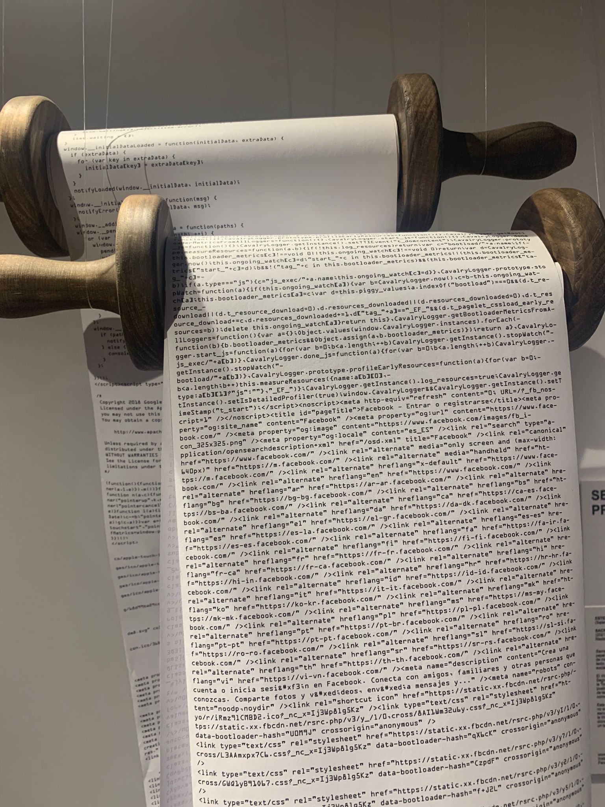

## Introduction

*Own collage, 1000 days of Github history in 2022, 2023, 2024*

I've been paid for writing software for 10 years, as of the past September. I wanted to take a moment to reflect on what I've learned, as well as share what I'm learning. 

Now, 3652 days is a decent amount of time. Some of you probably have double or even triple that number of years invested in your craft. I invite you to also talk about your experiences, your lessons and failures - I'd love to hear or read about it. 

*[T meltzer](https://upload.wikimedia.org/wikipedia/commons/c/c6/Decagonal_Dome_of_St_Gereon%27s_Basilica%2C_Cologne.jpg), CC BY-SA 4.0 <https://creativecommons.org/licenses/by-sa/4.0>, via Wikimedia Commons*

In this presentation we'll talk about:
1. Beauty
2. Sales
3. Alignment
4. Foundational beliefs

Many of the things I've learned are abstract ideas, but I've tried to include a fair share of practical advice. I hope you'll forgive me for not going too deep in my limited time - I hope to give you the seeds of ideas rather than complete meals.

*[Raphael](https://commons.wikimedia.org/wiki/File:%22The_School_of_Athens%22_by_Raffaello_Sanzio_da_Urbino.jpg), Public domain, via Wikimedia Commons*

> "Study the world around you. You may not like it, but you need to understand it."

This is the one core message in this presentation. The rest of it will be me giving you examples of how I learned to do that. Now let's get started. 

## Beauty

*[Sandro Botticelli](https://commons.wikimedia.org/wiki/File:Sandro_Botticelli_-_La_nascita_di_Venere_-_Google_Art_Project_-_edited.jpg), Public domain, via Wikimedia Commons*

This was me in 2015. I was writing my thesis on a requirements editor for a domain specific language my supervisor created for space projects. This was all written in Java 6 and Swing. Now, if you're not familiar with it, Java Swing looks like [this](https://commons.wikimedia.org/wiki/File:Gui-widgets.png). 

In our first checkpoint meeting, the folks from ESA flew over to review our work. They liked the functionality, but hated the interface, and ordered us to rewrite it all on JavaFX. That was the first time that I learned that it doesn't matter how good the functionality of a thing you make is, if it doesn't look good enough, noone will bother. That's not a bug, that's a feature. That was a valuable lesson, and I'm grateful to have learnt it so early in my career.

*Freischwimmer 190. [Wolfgang Tillmans](https://tillmans.co.uk/)*

I used to find art galleries and museums extremely boring, but they are incredibly exciting once you understand what is beautiful and aesthetic, at least on a basic level.

*Own Photo, [Straat Street Art Museum](https://straatmuseum.com/en), Amsterdam*

I cannot easily create beauty, but I know who to call if I need it, and I'm always trying to improve.

*Own Photo, [Falles](./Pictures%20of%20Falles%202022.md) in Valencia*

Some gifted people can't help but make masterpieces. I envy them. 

*[Matthieu Riegler](https://commons.wikimedia.org/wiki/File:IPod_nano_5G.png), Wikimedia Commons, CC BY 3.0 <https://creativecommons.org/licenses/by/3.0>, via Wikimedia Commons*

You don't have to make beautiful things, but is important to understand the basics what makes them beautiful. Color, composition, perspective and art styles are all skills, you can learn their basics by reading a book or taking a course. It's important that you consciously choose if you will invest your time in aesthetics, or any other task, and what that time will get you. Software engineers consistently underestimate this aspect of our craft.

## Sales

*Exit Through the Gift Shop. Image courtesy of Revolver Entertainment.*

Now let's go from an idealistic field, to a very pragmatic one.

Also around the same year, I built the first version of a tool that would end up becoming my business. The tool was an inventory management system for hobby stores, with automated pricing as the killer feature. You can understand that for a random Greek 20 year old with a goatee to walk into a business in France or Poland and try to sell magic software that would autoprice hundreds of thousands of inventory items... that was a tough sell. So I learned to sell.

*Own work, promotional brochure, circa 2017*

I don't claim to be an expert salesman but I was moderately successful. The most important sales skills I learned was "empathetic perception". This is the ability to know what the people in the room see when they look at me, what they want, and tell them how my proposal can help them get it, if it can. I know this sounds a bit vague and I don't want to bore you with stories that may feel far away. So here's an example of this empathetic perception, applied on a work meeting I attended in 2023:

.jpg)
*(Source: [Bill Branson (Photographer)](https://commons.wikimedia.org/wiki/File:Staff_meeting_(3).jpg), Public domain, via Wikimedia Commons)*

Imagine this scene. There's 6 people in a room, including me. The topic we are discussing is a proposal written by another engineer and I. We need a platform team to commit about 3 person months to help us . 

Architect:
* Previously worked on a similar proposal which didn't go anywhere. 
	* I should be careful not to offend them or their ego and acknowledge those efforts, as well as involve them for input on stuff they've learned
	* They care about the problem, and would like to see a proper solution, that's why they're here
* Their presence adds weight to the meeting, it's not just a cross-team request

2 engineers from a platform team:
* We have worked together before, we have mutual respect
* I expect that they'll be alt-tabbed half of the meeting working on code, so not the highest engagement from them
* They will probably call out technical flaws they see ideally during the meeting, but if they're feeling pressed by the presence of the architect, they may just stay quiet or talk to their manager instead - I should make sure to note their body language and ask them if at any point they seem concerned

Engineering Manager from the platform team:
* this is the main client in the meeting. I am selling primarily to this person.
* Their job is to defend team capacity, as they are overloaded
	* So I need to show that we are serious: Docs, PoCs, clear commitments and expectations
	* I need to run the organisational gauntlet to request their capacity
* Manager is extremely conscious of ownership and maintenance, need to be crystal clear on those and negotiate appropriately

Fellow engineer from my team:
* Great engineer, wrote a lot of our research and proposals
* I know that I often talk a lot - I should sometimes shut up and leave space for this person in the meeting
* The person has a different technical background than the rest of the team we're selling to, so I need to show how our complementary skills will help us succeed

Me:
* I'm the newest one in the room, so I shouldn't sound too confident when discussing past work
* we're touching a very critical flow component, so I need to be visibly overprepared. I am selling this idea to everyone in the room. If I lose their trust, the project gets stuck on low prio forever.
	* So I'm bringing a meeting agenda
	* I'm bringing links to RFCs and research we've done
	* And I have a board with diagrams
* I also need to be aware: How do **they** expect an overprepared professional to look? I opted to go with:
	* a clean shave
	* a nice shirt
	* and somewhat serious attitude
	* I am a guy with colored hair who speaks very excitedly and tests infra in prod. This serious overprepared guy is clearly not my usual persona, but it is what I think will be effective in this project

Do note the word persona as well. People will first perceive you, then filter it through their biases and then process the words you're saying. You can lose or gain their attention before you even speak. Some of that, you can control. Do you wear a company hoodie or a shirt? Do you talk fast or slow? What words and gestures do you choose? What's your Zoom background? When do you choose to talk? Many engineers love to think that they bring their single whole self to work, but that's not true, your company has a code of conduct and you are already performing a work persona.

*[Leonardo da Vinci](https://commons.wikimedia.org/wiki/File:0_The_Vitruvian_Man_-_by_Leonardo_da_Vinci.jpg), Public domain, via Wikimedia Commons*

You can spend some time to prepare a work persona that fits what you want to achieve, and then use the desired traits of that persona as areas to improve on. You don't have to do this, but be at least conscious of the persona you are projecting. Be careful though: Unless you're an actor or a roleplayer, it's kinda hard to pull off personas that are radically different from your usual behaviors.

Never lie in a sale. The worse thing is not to get rejected, it's to get a bad reputation, especially in smaller communities.

_-_Google_Art_Project_-_edited.jpg)
*[Pieter Brueghel the Elder](https://upload.wikimedia.org/wikipedia/commons/f/fc/Pieter_Bruegel_the_Elder_-_The_Tower_of_Babel_%28Vienna%29_-_Google_Art_Project_-_edited.jpg), Public domain, via Wikimedia Commons*

One last thing about sales, I promise, this is some excellent advice I've learnt from my father: Always add something extra to a proposal that the client can reject. This way you know and control exactly what they will negotiate on. For example, in a project proposal some years ago, I added a security review that the client would probably reject as unnecessary. This works in proposals as well as RFCs ;)

*Own photo of artwork which I think was titled "Holy Word". Cannot track down the original museum and artist sadly, I believe it was somewhere in Spain :/*

You might wonder at this point: Why is Alex telling us this stuff about beauty and sales meetings via stories? The answer is because humans are, in Terry Pratchet's words, "storytelling chimpanzees", and we've always communicated any meaningful concept from ethics to history to mathematics that way. Businesses love a good story, whether they're the underdog disrupting an industry or an established leader building chapter 3. A good story unites people like. Example: "we are crazy enough to stare into the Python abyss, and migrate the monolith releases. Wanna join us?". Like everything else, understand your story, and learn to write it and sell it. 

## Alignment

*[Piet Mondrian](https://commons.wikimedia.org/wiki/File:Piet_Mondriaan,_1930_-_Mondrian_Composition_II_in_Red,_Blue,_and_Yellow.jpg), Public domain, via Wikimedia Commons*

I started my career working on backend systems. It was a simple world honestly - you have clear system boundaries, and you have very solid foundations on testing, cicd, observability, architecture, the whole deal. Over time, as I had to actually deliver software to my clients, I got more into DevOps. When I started seeing the effort and process required to deliver software to production in bigger organisations, I went deeper into Site Reliability Engineering. 

*[The Harlequin's Carnival](https://en.wikipedia.org/wiki/The_Harlequin%27s_Carnival "The Harlequin's Carnival"), oil painting at Albright-Knox Art Gallery, Buffalo, NY*

Over time, I started seeing that the system was more complex than software or hardware. That's when I started focusing more on people, how they work together, and how a company achieves its business objectives by temporarily aligning groups of expert humans and systems on shared goals.

I've rarely seen a technical failure that cost more than an incident to resolve. Yet I've seen countless communication and collaboration failures that destroyed friendships, projects, companies, and even governments. 

A few years ago, I worked in a company where we encountered a serious collaboration issue. I was part of an overworked SRE team, dealing with about 2 incidents a week. The company was also working with some very skilled external SRE contractors. The C-Levels would ask them to build random PoCs, and they delivered. We would sometimes end up having to maintain these systems. Now we, the internal SRE team got mad at them for building solutions that were completely inconsistent with the rest of our production, and their configuration was often confusing to us. The contactors were frustrated at us because we tried to make them change a delivered system to adapt to our standards that were often different. There was lots of coldness and quite some conflict. The heart of the issue is that we had different goals: We were paid for keeping production running smoothly, and they were paid for creating novel projects fast.

*[Julian Herzog](https://commons.wikimedia.org/wiki/File:Red_Arrows_Formation_Duxford_Flying_Finale_2024_01.jpg) ([Website](https://julianherzog.com/)), CC BY 4.0 <https://creativecommons.org/licenses/by/4.0>, via Wikimedia Commons*

After nearly 4 months of this, the head of engineering took one person from each side, and made us work together on a major future project. With our goals now aligned, it was some of the best collaboration in my career. The contractor side would know already from the planning stage what would work and what wouldn't for our certifications and workflows. And from our side, when the contractors put fresh ideas on the table, we had the time and space to discuss and process them, and sometimes adopt them across our infrastructure before the new project would arrive.

*Possibly photographed by or for E. C. DeWolfe, but possibly provided to him by the coal company or the locomotive manufacturer., Public domain, via [Wikimedia Commons](https://upload.wikimedia.org/wikipedia/commons/1/1a/Mammoth_Vein_Coal_Fig_8.jpg)*

Sociologists have an excellent term for this: "Sociotechnical systems". [Wikipedia](https://en.wikipedia.org/wiki/Sociotechnical_system) defines Sociotechnical systems as:
> an approach to complex organizational [work design](https://en.wikipedia.org/wiki/Work_design "Work design") that recognizes the interaction between [people](https://en.wikipedia.org/wiki/People "People") and [technology](https://en.wikipedia.org/wiki/Technology "Technology") in [workplaces](https://en.wiktionary.org/wiki/Workplace "wiktionary:Workplace").

The idea is incredibly simple at its core, yet quite underappreciated. Work is done by humans and machines, so improvements to work need to address both humans and machines.

*[Addshore](https://upload.wikimedia.org/wikipedia/commons/3/3b/Wikidata_maxlag_grafana_dashboard_showing_lags_and_reduced_editing_in_Feb_2022.png), AGPL <http://www.gnu.org/licenses/agpl.html>, via Wikimedia Commons*

Take for example a single alert:
* A human studies data, determines an alert condition, and writes the alert
* Humans participate in on-call rotation
* A system maintains the alert, monitors the data and fires the alert
* Another system processes the alert, and notifies a human
* The human responds, and engages more humans to solve the problem

Any analysis to this workflow that does not take into account humans and machines working together is limited. When engineers put on their silly technical-only goggles, they will often focus on minor technical fixes rather than meaningful systemic improvements.

## Foundational beliefs

*Diego Delso, [delso.photo](http://delso.photo), License [CC BY-SA](https://creativecommons.org/licenses/by-sa/4.0/legalcode)*

After these stories, I wanted to wrap up with something more structured. These are 6 statements I believe now, but I disagreed with 10 years ago. If you disagree, I'm genuinely interested to hear why: Feel free to start [a discussion with me](https://www.alkoclick.space/about) via email or any of my social platforms.

* All tech is political
	* Tech is created by humans, who are biased imperfect creatures
* The best code is no code
	* Some things should not be built. Some things should not be maintained.
* Your career is not coding. Your career is writing
	* Sometimes that writing is code, sometimes it's communications
	* Train that writing skill
* Code and docs should be optimised for reading, not writing
	* Your 10 minutes are multiplied across 10s or hundreds of people, multiple times over
* There is an optimal medium for sharing every idea
	* Text isn't always the best choice - stop using it just because it's the easiest
	* You have text, audio, video, diagrams, live presentations with Q&A
* The most important skills you will learn in your career, are not technological
	* If you can learn to read SQL, you can learn to read people's body language (and other nonverbal communication cues)

Thank you for devoting the time to read this. I hope it can help you waste less time than I did. 

> "Study the world around you. You may not like it, but you need to understand it."

This is the one core message in this presentation. The rest of it has been me giving you examples of how I learned to do that.

