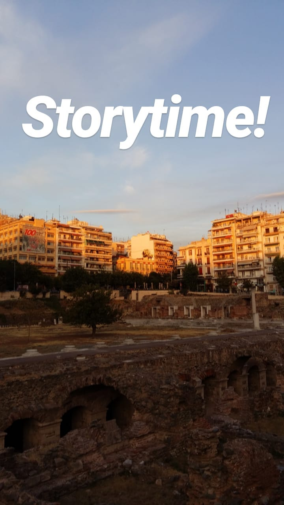
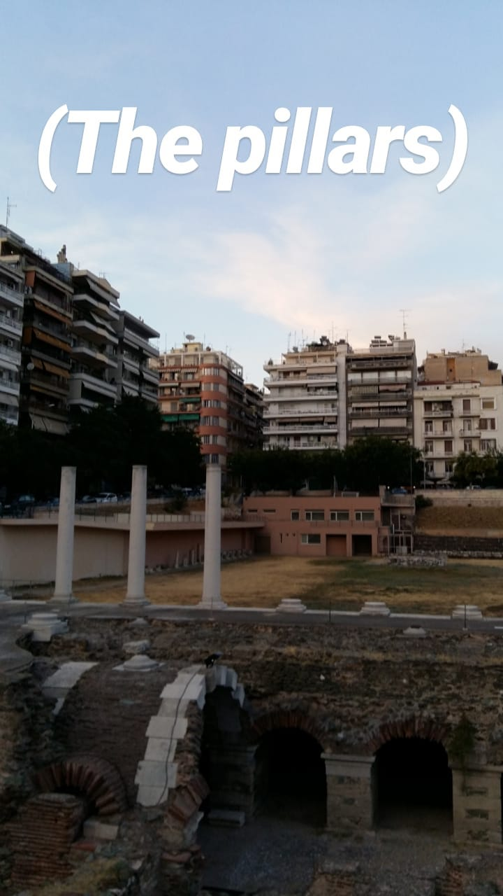

Originally posted on IG in 2017

---

Those of you who have been to Thessaloniki, definitely know this place: The Ancient Roman Forum (market). But what hides beneath the surface of some cranky old ruins? Let us explore...

It's the 1980s and the urbanization of Greece is in full effect. The economic rise gives people reason to chase their "big" city dreams. Thessaloniki grows from ~200.000 to 700.000 people.

Clearly all these people need space. At the time, this area was largely an empty park with a few rocks thrown around. The city decides to build a parking lot to alleviate the situation.

But the archaeologists called to check the area (that's a thing in Greece) protest! They think there are important hidden ruins underground and they attempt to stop the excavation... But to no avail. They haven't found anything of importance to stop the searching. With the builders ready to dig, all seems lost! 

(The following is not an official record and only an urban legend in the neighbourhood). But a team of archaeologists sneaks into the area one night. They are carrying something they have just created, that they hope might change the future of this landscape.

Whatever the reasons, the archaeo team suddenly stopped trying to protect the area. They went to the town hall. "We give up" they said. "Dig freely". And the digging started soon afterwards...

Only to stop within two days! What a surprise that 3 perfectly preserved pillars are uncovered just barely below ground! The archaeo team is called again and they concur - this finding is of the utmost importance! Does it matter that the pillars have a different style than the rest of the ruins? Or that they seem completely out of color with the wear and tear everything else has? No! The city decides this is now a protected area. The building stops.
 

The archaeologists won! Soon after, they begin to realize the true significance of the ruins buried deeper. This was the absolute center of the old city including the market, a theatre, and the baths!

The greatest finding of all? A double-edged ancient marble dildo. In the men's baths. Oh yes, that's a historic finding. 2013. Look it up.
