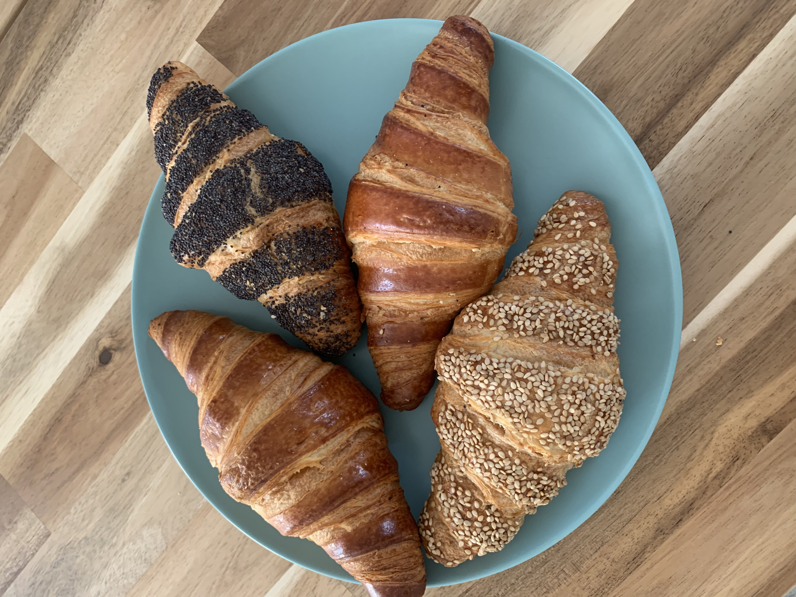
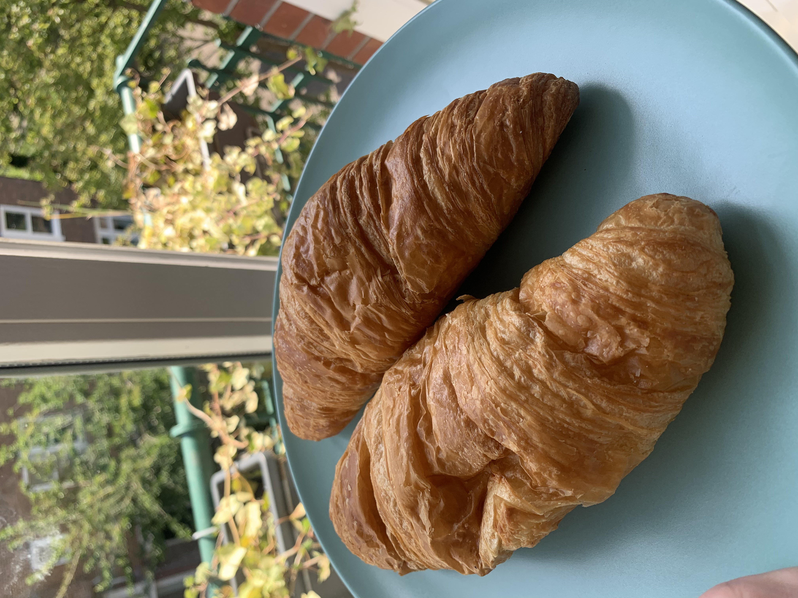
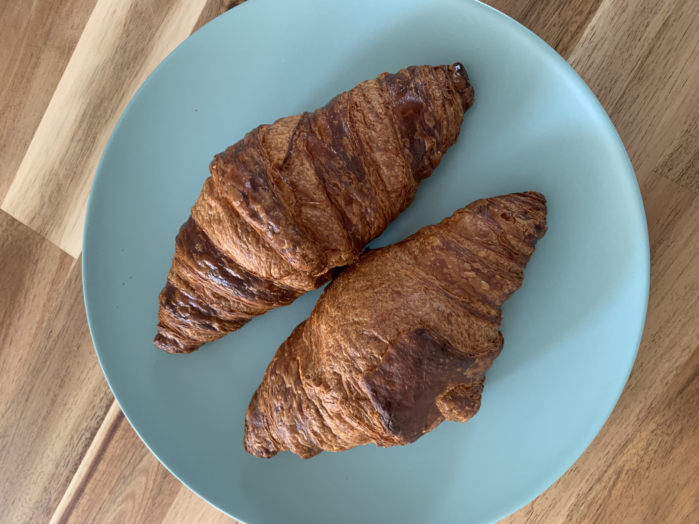
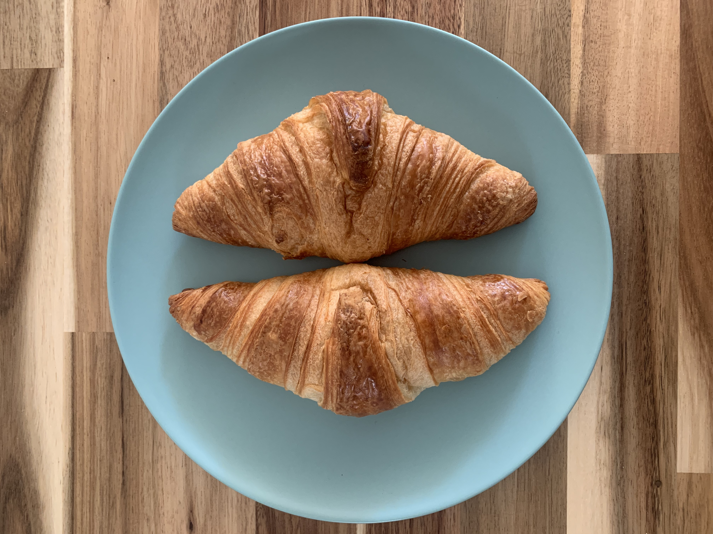
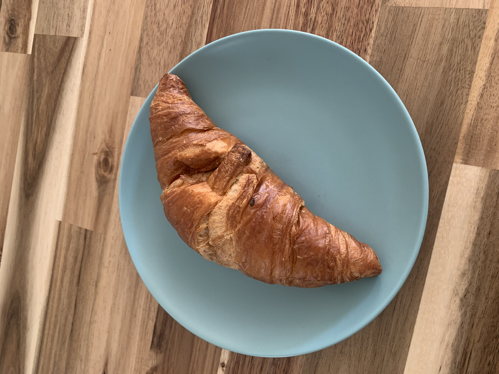
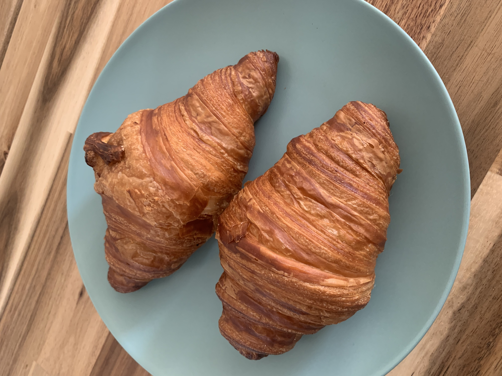
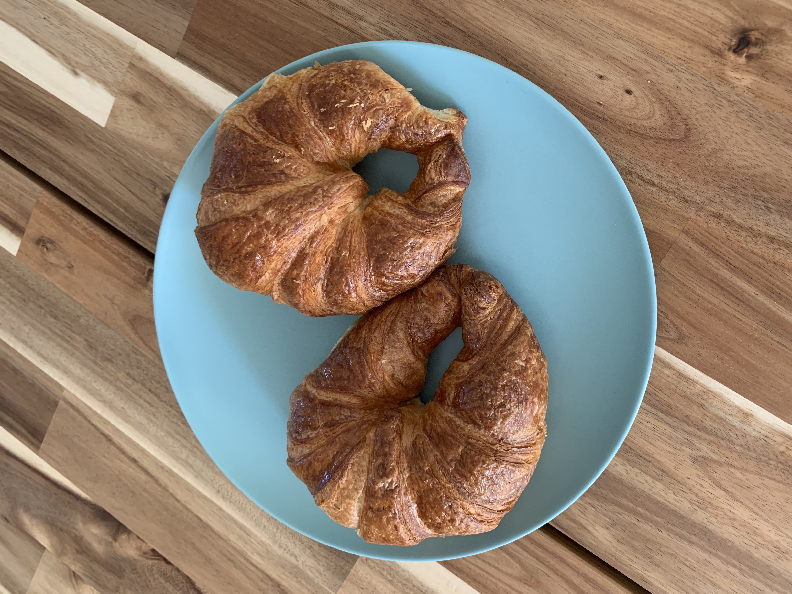
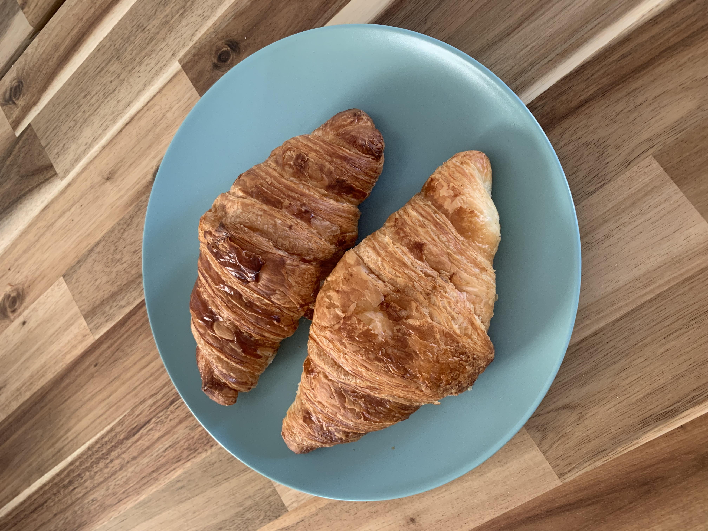
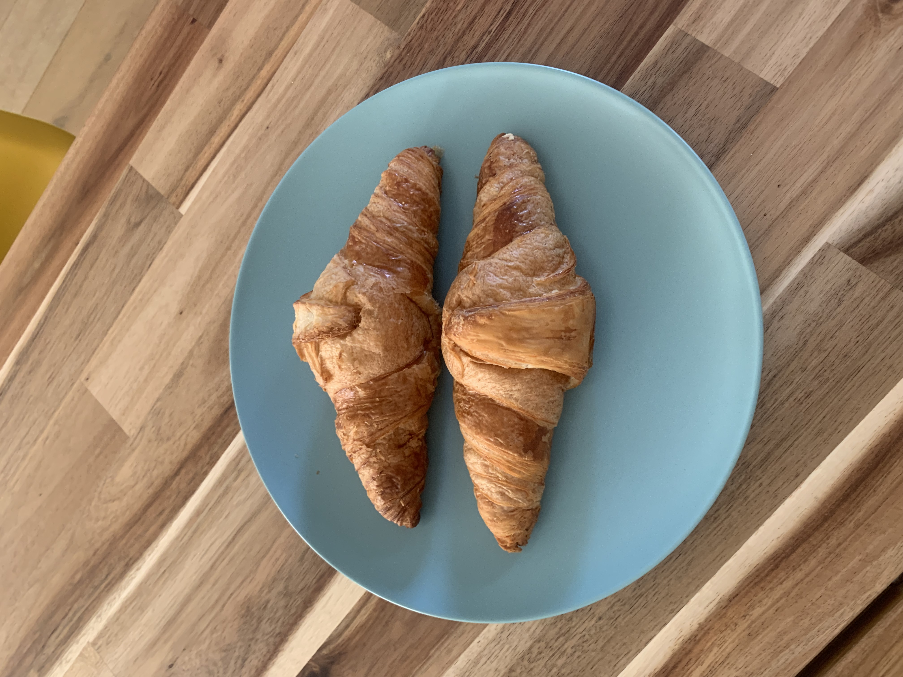
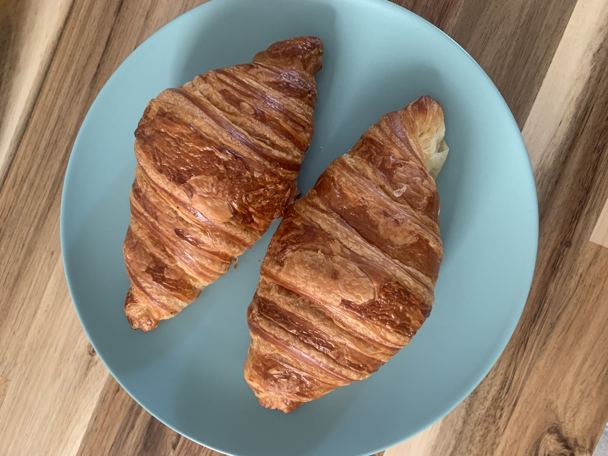

After watching [Luis's Paris top 5 croissant reviews](https://www.youtube.com/watch?v=wp84sRpM1Js), my partner and I were inspired to make our own Amsterdam croissant reviews, so here we go!

## Tried

[Bakkerij Westerbos](https://goo.gl/maps/HDt1rbwWizZbSXmo9?coh=178573&entry=tt)

1.45€
Multiple choices of great croissants. Sesame was my favourite. Crunchy and fresh. Substantial, trully fills the mouth. Possibly a bit too buttery for some, but I loved it.

---

[Bakkerij Westerpark](https://goo.gl/maps/AFLho5rWmXjubWpK8?coh=178573&entry=tt)

Overall mediocre. Felt kinda stale. Not cunchy at all. Slightly buttery.

---

[Vlaamsch Broodhuys Elandsgracht Amsterdam](https://goo.gl/maps/TYuBWMxEd7SGVkxU6?coh=178573&entry=tt)

2.0€
Very crunchy, perhaps even a bit too much! Felt decently fresh even though I got them around 14:00 in the day. Not very buttery in flavour.

---

[BBrood](https://goo.gl/maps/bspJ5iv5ycCbCzhA9?coh=178573&entry=tt)

1.75€
Substantial, multiple layers inside. Not that crunchy, and didn't taste very buttery. Felt slightly less than fresh, but we got them late in the day (around 13:00)

---

Jumbo

0.39€
More toasted on the outside than some of the other options. Mildly flaky. Not a lot of layers, not very fluffy. Fairly balanced flavor. The plate in the picture is smaller than the plate we used for the other pictures btw.

---

Saint Jean

2.5€
Crunchy, buttery, sweet & roasted flavor, juicy inside. Bigger than most of its competitors. A croissant with opinions.

---

[Cup a la cake](https://goo.gl/maps/39fMEzXd9sLCLt516?coh=178573&entry=tt)

1.75€
Very airy, light and somewhat buttery. Decently flaky, though not crunchy. One of the few with a complete half-moon shape!

---

[Simon Meijssen](https://goo.gl/maps/LLABWXqzT6Qoyq7d6)

Multiple layers inside and outside, pretty big, relatively neutral flavor with slight butteriness, slightly stale but it was end of day. 
2.55€

---

[Bakery Cafe Mensink](https://goo.gl/maps/DuLbnziuACg1TD7MA?coh=178573&entry=tt)

Petite is the word that comes to mind. Light, flaky, and crunchy. A bit reminiscent of the AH and Jumbo light croissants. Feels a bit overpriced for the amount.
1.75€

---

[Fort Negen](https://maps.app.goo.gl/HixPvoBLSZUs4BRC6)

Smooth inside, crunchy and flaky outside. Didn’t feel too buttery for me. Definitely quite fresh. Long queues!

## To try
These are the places that are still in our list to explore

[Andere Koek](https://goo.gl/maps/QmqTMij32WndcEpy7?coh=178573&entry=tt)

[Hans Egstorf](https://goo.gl/maps/9tyxmxyvuyJc1Pwa7?coh=178573&entry=tt)

[Loof](https://maps.app.goo.gl/RKKHMutYgDzauJpf7)

[Le Fournil de Sébastien](https://maps.app.goo.gl/j1GNYWWCzjVhcdSB9)

[Ulmus Bakery](https://maps.app.goo.gl/kWQSmG4NyoogS8hAA?g_st=ic)

[Grammes](https://www.google.com/maps/place/grammes/@52.3472458,4.892765,17z/data=!4m14!1m7!3m6!1s0x47c6090f89586acd:0x59290c0844e3c6fa!2sgrammes!8m2!3d52.3472458!4d4.8949537!16s%2Fg%2F11qqx1zs_q!3m5!1s0x47c6090f89586acd:0x59290c0844e3c6fa!8m2!3d52.3472458!4d4.8949537!16s%2Fg%2F11qqx1zs_q?entry=ttu)