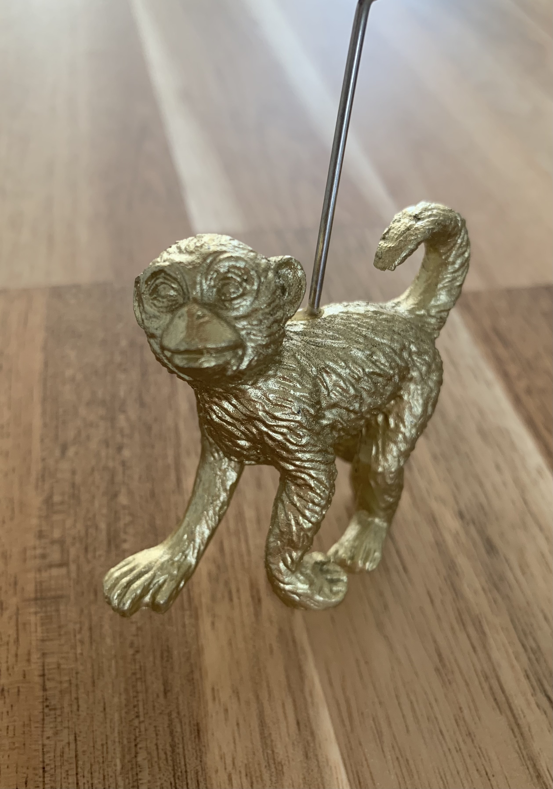

On a warm April Sunday, my partner of and I decided to do some housecleaning. That we both decided this is kind of a misleading statement ; put more precisely, she accepted the sacrifice some objects to my minimalist sensibilities. Amidst a mess of invitation envelopes, company letters, and Easter decorations, lay a small, unassuming golden monkey photo holder. The monkey had arrived with my partner from Spain when her mother successfully got rid of it.

On a whim, I decided to keep the monkey around for a little bit, and spent the next few days hiding it around the house for her to (un)excitedly discover: the fridge, the toilet paper shelf, her underwear drawer. One of the next days, and as my partner’s patience was running out, I went out running. The monkey was in my thoughts because it puzzled me why I hadn’t gotten rid of it yet. A sudden thought occurred: What if I could turn this nearly universally disliked object, into something meaningful? 

Could I instil meaning into this object, and if yes, how? 

To answer that question, I needed to start by defining these meaningful objects.

## Definitions

"Enchanted" objects are objects which have some property besides their physical characteristics In the perception of one or more people.

These objects share the common fact that there is some special meaning about them. This meaning is unique both to the object and to the beholder(s). Some folks feel the dress Marilyn Monroe wore in her last public appearance is special enough to warrant 4.8 million US Dollars - for others it’s just another sparkly dress.

In the 2003 emotional rollercoaster Jeux D’Enfants, the protagonists have a music box and an agreement: Whoever holds the box can ask the other to do anything. The box is enchanted to them.

Your wedding ring is enchanted for you and your spouse, but probably not for the jeweler who sold it to you.

Curiously, the same applies to things which are otherwise perceived as fungible - that is they should be completely interchangeable. One such thing is money. Money is something we usually treat as fungible and yet, Scrooge Mc Duck's most prized possession is one particular penny. In his case, the penny is meaningful to him because it was the first money he ever received as his own. In the physical world every object is unique - and every unique object can be enchanted.

## Enchanted Digital Objects

But what about the digital world?

I don't know whether we can have enchanted digital objects. The now classic essay [[The Colour of Bits]] touches upon a similar topic. The author argues that a specific arrangement of bits may be special, based purely on its providence - where it came from. The author makes a very extended point on how computer scientists are trained not to see the "colour" (providence) of bits because computers can't perceive it, yet society values the understanding of that property.

Yet when you are able to make infinite, perfect copies of an object, could you have uniqueness? Especially given that a bunch of computer operations are not "move these bits around" but rather "copy these bits somewhere else, then erase the original". I feel most people don't perceive that when moving a photo from their camera's flash drive to their computer creates a perfect copy and removes the original, yet that's precisely what is happening.

For rewriting:
What about your WoW character, a level 75 night elf with a collection of mighty items? Another user could build the same character and give them the same items, even join the same clans as you, yet if you sat at their computer you would inherently know that you are playing another character.

Just to address that: Yes, I'm aware of NFTs, but no, I don't think they add anything meaningful to this discussion.

## When things are beings

On [[2023-03-04]] I visited the Stedejlik modern art museum in [[Amsterdam]] that had an exhibition titled: "When things are beings". Different artists were exploring the concept of objects and spaces which are more than mere objects. There is an interesting [related booklet](../media/when-things-are-beings.pdf) with the text of that exhibition (though sadly not too many pictures).

## Enchanted religious objects

Religion and magick have a long history of both using enchanted objects and actively creating new ones. In fact, it's often central to the practice.

Let's look at two different approaches of enchanting objects in Orthodox Christianity, which I'm quite familiar with.

1. The bread and wine are converted to holy communion through a ritual. The bread and wine at the start of the ritual is normal, and the bread could have been baked that very day. Through the process of saying some things, and doing some movements, in specific clothing, in a specific room within a specific location, a specific person of the religion enchants this bread. The bread has thus been enchanted and converted to the “body of Christ”.

2. The "Holy Light" is candle light which is said to come from a cave in Jerusalem where it is said to burn forever. During the Easter eve, which is Saturday, It is flown from Jerusalem to Athens, then transported from there to all churches in Greece and shared with people later that evening. In this case, it is the providence of the the light, where it came from, that matters to believers. They can then enchant their own objects, their candles, with that Holy Light, thus connecting to the chain of providence.

## Empowering or destroying enchantments

The strength of any enchantment is based on the belief of the beholder(s). The belief, in turn, requires the believer to be aware. One of the ways you can destroy the enchantment of an object is quite simply forgetting it. Many of your favourite childhood toys have probably suffered this fate. On the other hand, you can use memory to your benefit: you can note down the reasons why an enchanted object is meaningful to you at a given point in time, so that your future self will have the ability to better connect with that enchanted object. You can also name an object, which will help you personify it more, further strengthening that bond.

## But why?
As a self-proclaimed minimalist, I’ve struggled to connect with objects for any purpose other than their primary function. When that function ceases to be important, so does the object. However, I see folks around me that have a sentimental attachment to multiple objects, and I’ve struggled with understanding why. The enchanted objects framework allows me to model that relationship in terms that make sense to me.

Yet more than that, I find it fascinating to know how to infuse meaning onto an object. There are so many objects that have a strictly practical function in our lives, like a water heater, or an oven, or your forks. What if you could make those more interesting? You could give them an importance higher than just their strictly practical functions. What if you could give someone a gift that is not only a special object, but it also has meaning attached to it?

---

## Origin of the term “Enchanted Objects”

The Google search for "Enchanted Objects" is polluted by some internet-of-things project some MIT guy did a few years ago. Yet I distinctly remember coming across this concept somewhere else in writing. I believe it was in some social network where someone mentioned these words and linked to external references about some author or journalist introducing the concept.

---

On [2023-05-13](../../2023-05-13.md), in the beach of Donostia-San Sebastian, I baptised the monkey in the Atlantic water. My partner, now officially the monkey's godmother, decided on the name "Sebastian".

## Open Questions

How would you enchant an object with "air"?
* Open holes in it and allow air to pass through them
* Allow air to shape it

Is there a limit to how many objects you can enchant?  Does scarcity affect the strength of the bond?

Is there a difference between saying this is "my personal" object and saying this object  is "enchanted with me"? Does that apply to all personal objects?
* Not much probably
