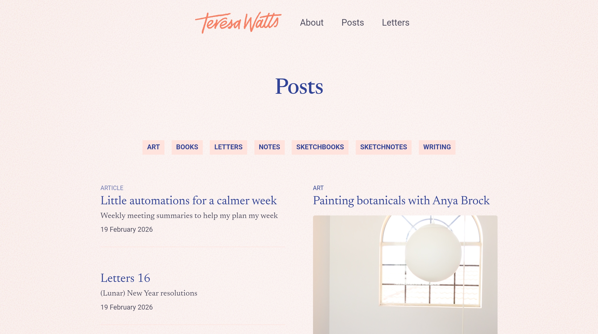

A specter flies over this blog... the specter of indecision on what content it contains, and how to best present it. What do?

In short, as evidenced by me using the word "blog" earlier, the semantics of alkoclick.space are really blog-based. There is a reverse chronological order of a feed in the main page. It looks like this:

This would make sense... if I were writing a blog. My entries would be (perhaps) more topical, content would be way more rarely updated after publication, and there would be a single publication date to be used to anchor the document in the feed.

But I don't. Many of the entries in this list are more akin to wikipedia entries, updcated often, and linking to each other. Due to the need to provide some form of date, which I autogenerate based on last file "touch", multiple entries have the same date, which is usually my last push.

This:
* Provides false information
* Fucks up RSS
* Doesn't look good
* Provides an inaccurate mental model for this space

How do we address this? We need something that's closer to what Obsidian calls a "digital garden" or the rest of the internet calls a "wiki".

Let's take a look at how strangers on the internet are using the Obsidian [Digital Garden](https://dg-docs.ole.dev) plugin to curate their spaces:

[Teresa Watts](https://teresawatts.com), a UX Designer and artist uses a "posts" page with tag filters, and some aesthetics to break away from a classic reverse chronological post list.

[Ole Eskild Steensen](https://ole.dev) who is also the author of the [Obsidian Digital Garden](https://dg-docs.ole.dev) plugin, uses a home page that is an organized list of links by category. Notably absent are dates.

[Aaron Young](https://ajy.co) has a page that looks highlights a few different areas of his interests, and rather than tags, he uses listicles (perhaps meta-articles is a better descriptor) on the sidebar to highlight core areas of his interest. 

Notably common across these implementations is how these authors attempt to group their thoughts into distinct spheres of interest, then present those as top level ideas. 

Now let's take a step back: [What do digital gardens mean, and where did the concept come from?](https://maggieappleton.com/garden-history) 

I'm not gonna summarize that well-researched article for you, go ahead and read it, it's great. It also contextualizes much of the ethos of digital gardening as we perceive it today (at least for me). Here's a fun entry from there: [Digital Gardening ToS](https://www.swyx.io/digital-garden-tos).

Key thoughts I have after reading the above:
* It makes more sense to roll something handmade, that's part of the gardening
* I should increase linking between my entries to allow a smother exploration
