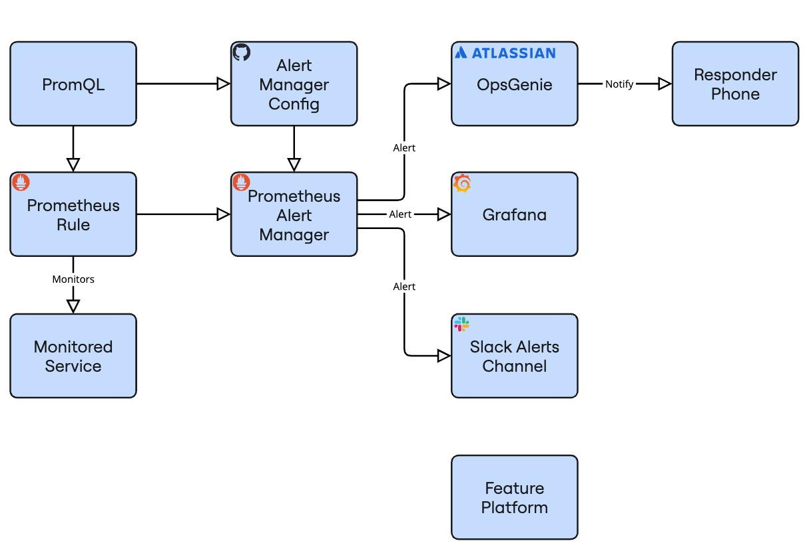

How do you modify, or even improve a any non-simple system?

Sociotechnical systems vision is the term I use for viewing systems through the individual lenses of social and technical work, then overlaying them to perceive a more complex system. I'm pretty sure that there's a more appropriate term somewhere in the literature for this, but work with me for a moment m'kay? The field of [Sociotechnical systems](Sociotechnical%20systems.md) is fascinating to me, and I wholeheartedly recommend reading more about it.

In this article, we'll practice sociotechnical systems vision on a simple example. Along the way (hopefully) we'll demonstrate that system optimisation should work on both the social/organisational and technical dimensions. But first...

## Stereoscopy and Sociotechnical principles

Do you remember the 3d glasses that were somewhat popular around 2000?

<a href="https://commons.wikimedia.org/wiki/File:Chick_Quest.png">Irisblixten</a>, <a href="https://creativecommons.org/licenses/by-sa/4.0">CC BY-SA 4.0</a>, via Wikimedia Commons

They are called red-cyan stereoscopic glasses. They work by filtering out colour ranges so that your left and your right eye end up seeing slightly different pictures, both of which have partial depth information. When you look through both eyes, the image is overlaid and your brain perceives a more complex picture (the stereoscopic illusion) than the individual pictures. This leads us to the first of the two [Sociotechnical principles](https://en.wikipedia.org/wiki/Sociotechnical_system#Overview):

> The interaction of social and technical factors creates the conditions for successful (or unsuccessful) organizational performance. This interaction consists partly of linear "cause and effect" relationships (the relationships that are normally "designed") and partly from "non-linear", complex, even unpredictable relationships (the good or bad relationships that are often unexpected). Whether designed or not, both types of interaction occur when socio and technical elements are put to work.

Let's say you have a picture like the following, which can be viewed with these red-cyan glasses. What if you want to improve it by making the hammer bigger? You don't have to be a stereoscopy expert to understand that changing only the red part or only the blue part of the picture will surely fail - you need to change both. 

<a href="https://commons.wikimedia.org/wiki/File:Hammer_anaglyph_(14656149338).jpg">Gabriel Rollenhagen</a>, <a href="https://creativecommons.org/licenses/by-sa/2.0">CC BY-SA 2.0</a>, via Wikimedia Commons

This gets us to the second principle of sociotechnical systems (and corollary of the above)

>  Optimisation of each aspect alone (socio or technical) tends to increase not only the quantity of unpredictable, "un-designed" relationships, but those relationships that are injurious to the system's performance.

Now is time for our practical example. Let's say you have created an alert.

## Technical

Let's turn on the cyan technical eye, that solely sees technical systems and interactions. In that case we'd see something like this:

The above diagram maps a fairly typical alert delivery diagram:
* PromQL, the query language to write the alert in
* Repository that controls a simple alert manager config
* Prometheus, the system that does the monitoring
* Prometheus alert manager
* Monitored service
* Grafana, which can display your alert and other metrics
* OpsGenie, a tool to manage and reach on call staff
* Responder phone
* Slack channel to receive alerts in
* Feature platform, which we will assume can disable the feature causing the alert

## Social

Now let's turn on the other eye, the red one, and look at the social side of the same space:

This diagram maps some of the organisational aspects of alert creation, response and delivery:
* Alert created after incident due to policy
* Alert has to follow company conventions
* Alert requires approval by o11y team
* Human on call rotation
* Group of engineers following the alerts channel
* Grafana is not accessible by all team members
* Feature platform is unclear to a lot of engineers, they haven't used it

Notice that the human side has a lot more actions. One of the powerful features of humans is that they can generally adapt to unexpected scenarios, and are usually authorised to act accordingly. Most incidents I've observed are solved by humans taking actions.

## Sociotechnical

Let's overlay these diagrams, and switch to vertical or we'll run out of space

Okay now, this is indeed a lot of complexity 😅  This diagram helps our brains perceive a picture that's more than the sum of its parts.

If we were to describe the diagram, in short:
1. Humans create an alert
2. Machines manage and deliver the alert
3. Humans have to be available to respond
4. Humans have to access, know and use technical systems to respond successfully

## Observations

A few things stand out for me in the diagram above:
* Notice the terminal states highlighted in grey. These are fail states. Typically an operator arriving there is out of immediate options, besides escalating to an unknown other, if they exist and are reachable
* Notice the spectacular amount of wasted effort if our operator reaches the final step, the feature management service, and cannot use it
* Notice the mingling of social and technical actions. This system cannot reach a success state without the collaboration of humans and machines
* The moment when control passes from machine to human is quite important. In aviation, they call it “transfer of control” and in their field, this is often where the failures that kill people actually happen

Equipped with the above, we are now able to perform "Joint optimisation", the design and improvement of both sides of a system to maximise our desired output. Some examples of joint optimisation questions that are meaningful in the alerting context are:

> How can we improve average time to understanding an issue?

We'd need to make sure our alert evaluation interval is fast, the alert fires as soon as it has enough data, and that the alert is clear and unique for the responder to parse or look up. That last part is usually the most time-consuming, yet is invisible if you're looking purely on the technical side.

> How can we improve average time to mitigation?

Besides the above, we'd need to make sure that all responders can access the feature platform, know how to use it, and have permissions to hit the “disable” button on a feature. We'd need to have an on-call rotation to reliably have a responder available. Besides the main on-call responder, if the alert successfully propagates to Grafana and Slack and the responders can access and follow those platforms, we may be able to enlist additional responders. 

## Conclusions

Sociotechnical systems vision is the ability of seeing a system via a social, technical and finally a combined sociotechnical lens. Typically only the last one actually represents the system's complexity. Joint optimisation are the meaningful ways to improve the system which usually surface when you see that full complexity. 

In short, failing or refusing to see the organizational aspect of any tech system is like working with your one eye permanently closed 😉