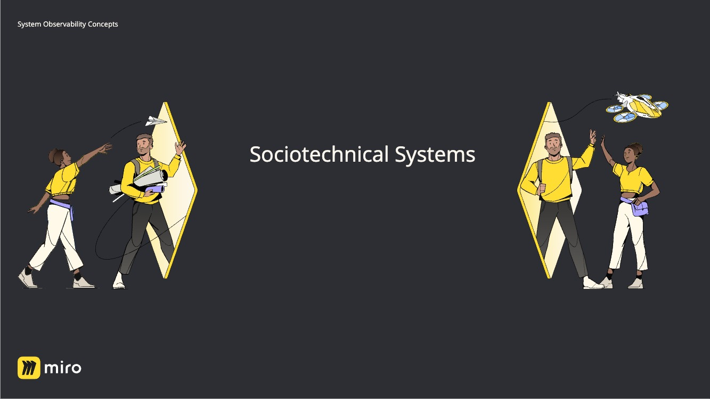

This is a lightning talk I did within Miro on September, 2023. Note to readers in the web version, you may also find my outline of this paper interesting: [9 Principles of Sociotechnical Design](9%20Principles%20of%20Sociotechnical%20Design.md).

Hi, I'm Alex! I'm here to talk to you about Sociotechnical systems. The term has become more popular in the tech community recently, but actually originates from research on coal mining during the 40s! The key idea is that any meaningfully complex system is an interaction between humans and machines, and making improvements thus needs to be aware of the skills and needs of both parties.

It is quite easy to see this in action, if you just try to list the tasks you perform in your day-to-day, and split it, for the sake of argument into the buckets of "social" or "technical". Here's my list from a couple of weeks of working with a development team within Miro. I have a few educational tasks that were primarily social, and I have some more solo optimization tasks that were more technical.

One easy example I've come up with to help you explore sociotechnical analysis of your system, is this question: "How healthy is your application right now?" Simple question, right? Let's dive in.

If we focus on the "your application" part for a moment, that's primarily a social matter. What "your team", and what "your application" means are concepts typically decided organizationally and then evolve somewhat organically as people coordinate.

Now what if we focus on the word "healthy"? You would typically use some technical tools and figures to tell me how fast your application responds, and how effectively users are getting to their destinations. But what is an acceptable latency? What is the intended user destination? Humans negotiate those, and humans optimize the system to maintain compliance, or remove it altogether when it fails.

I could of course also focus on the "right now". Live observability data is typically provided by thoroughly technical observability systems, and delivering it usually requires an equally detailed pipeline of technical excellence. Of course... that was all once built by humans coordinating in a very social way.

In our field, we often have the myth of the "brilliant inventor", a technically excellent (and usually socially incompetent) genius who can create the future. That's an unfortunate hoax. All our systems are sociotechnical, and the more you recognise that, the more you can make meaningful improvements to them. 

Thank you so much for your time.