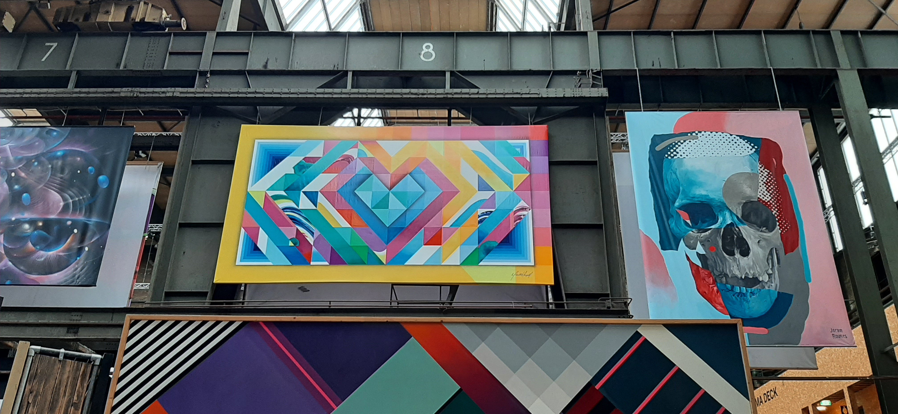
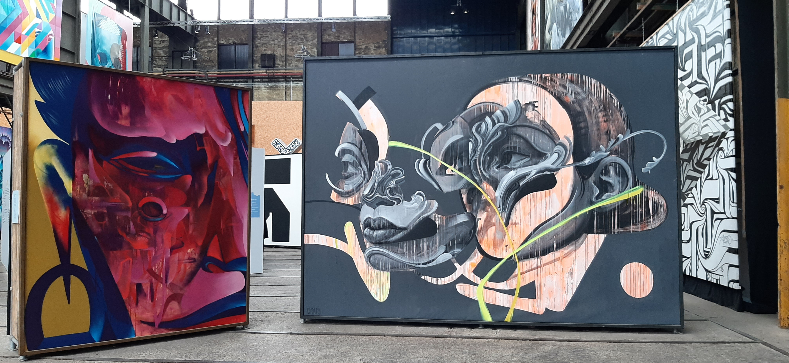
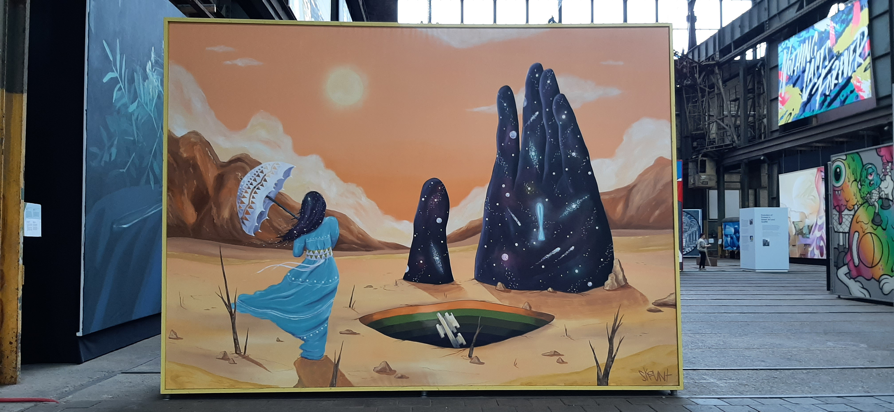
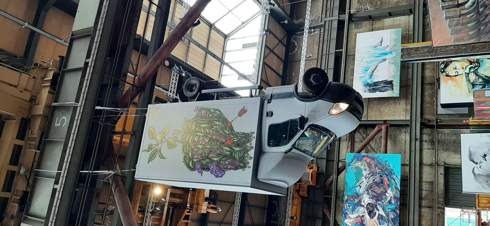
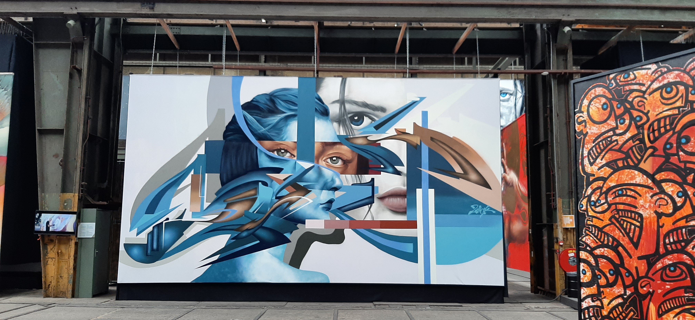
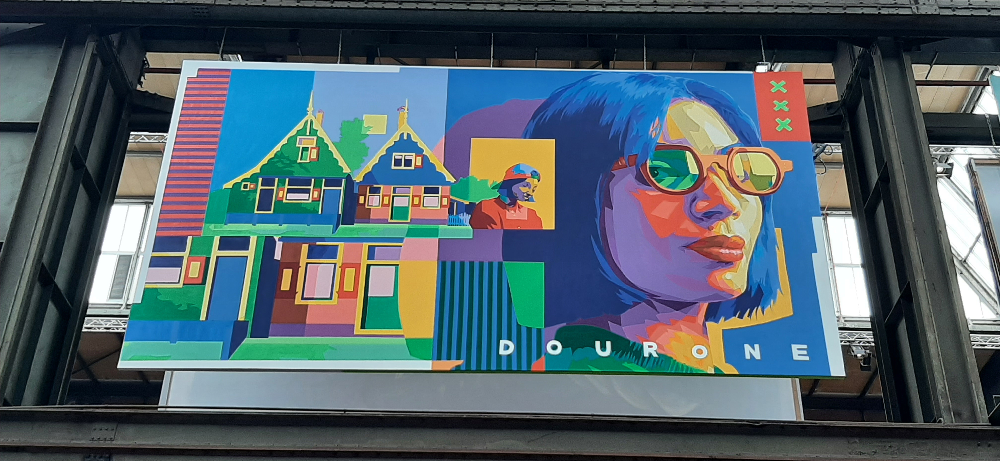
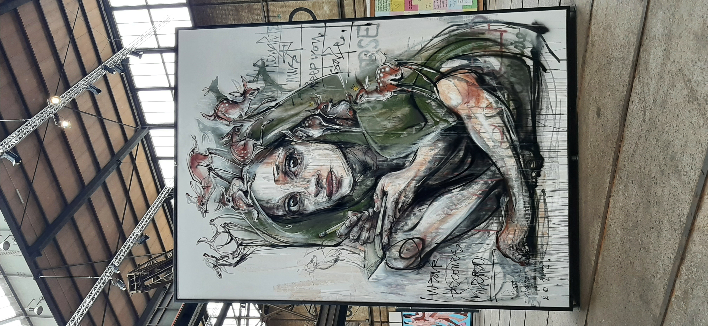

Overview:
Straat is a Street Art Museum in Amsterdam. It's in the old NDSM area, which is pretty cool, but getting rapidly gentrified. It's one of my favorite museums in [Amsterdam](../../Amsterdam.md), but sadly they're not on Museumkaart's list, so you have to actually pay the full ticket price :/

Links:
* [Google Maps](https://maps.app.goo.gl/eYzB6XkUgkvEAbsU6)
* [Website](https://straatmuseum.com/en)

Pictures:

