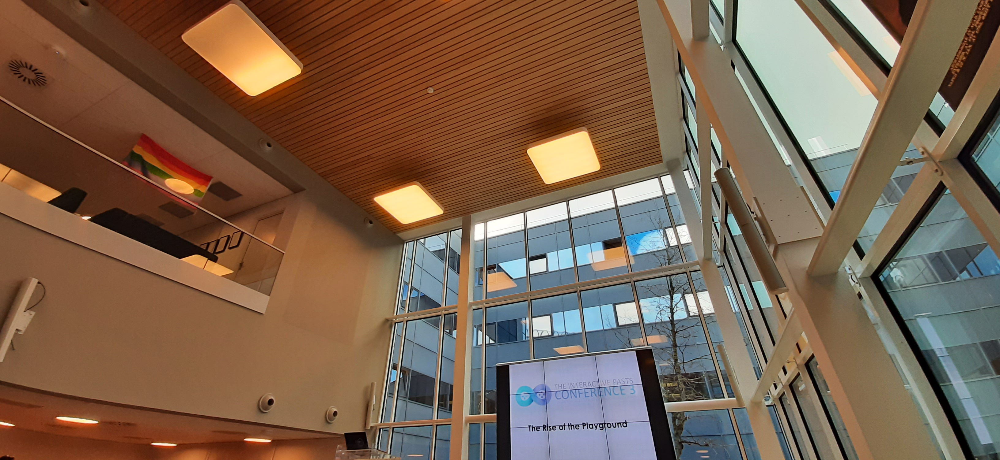

These are my notes from watching [The Interactive Pasts Conference 3](https://interactivepasts.com/the-interactive-pasts-conference-3/).

The event was streamed live on Twitch.

# Thursday May 25, 2023
Twitch link: https://www.twitch.tv/videos/1828789106

## Intro & Welcome
* If you weren't aware, Value foundation runs this
* 47 abstracts, 21 received
* Fortnite branded nerf guns as a timekeeping mechanism - interesting

## Playing with wisdom tree
Dr Frang G Bosman
* Dude has an amazing vest, really colorful with Dali-like shapes
* Let's talk about Bible games, that never hurt anyone lol
* "Let me already tell you, they're not the best quality on the market"
* Humor's on point
* Theatrical presentation helps freshen up his definitions and intro segment
* Oh no, videos can't be played? What will professor theology do? Fight Bag Item Run
* He's choosing to... request IT support from the conf organizers. Bold strategy, let's see how it plays out
* Looks like he managed to stand through the YT video loadings and even the ad part
* Why Christian games usually suck in 4 bullets:
	* Bad history of sucky past games taints the genre
	* Focus on narrative, ignore everything else, and contradiction between the message and the medium
	* Too focused on evangelizing, so you are automatically primed to block it
	* Too focused on the "Christian" part of Christian games, so they lose some of the audience because of the identification

## A Digital Hajj
Tyler Kynn, PHD
* Presenter co-created the Hajj trail game, inspired by Oregon Trail
* https://www.hajjtrail.com/
* "Too often Ottomans are presented in negative contexts of violence and war in the media" - this game aims to provide a more balanced perspective to the history
* Now describing part of his dissertation which is somebody's journal when they travelled from Sarajevo to Mecca
* So why a game instead of a book or text? Because it can convey things such as time in a way that a book cannot. It can also provide an experience in first person and allow self-identifying with the protagonist in a way a book can't.
* Looks like the somebody (who was Bosnian btw) was pretty shocked to find a desert and lack of water (massively reductionist take on the presentation's message)
* "The greatest challenge of the Ottoman empire was distance, and time required to cross it"
* Used twinery.org for organizing the storytelling
* Different pilgrims took different journeys - such as a longer one for visiting relatives for example

## The Archaeology Awakens
Amanda Pina
* "Teaching art and technology should not be just confined to academic books" - Preach!
* Okay the contents slide is pretty long, lol
* Cyber-Archaeology "The utilization of cybernetic tools to build archaeological scenarios" - cyberpunk.avi
* Archaeogaming: The study of archaeology within and around videogames
* 40 interviews in general
* Ok I feel kinda cheated at this point, this is like a work presentation
* I do respect the research though
* So the game she's building is 2d mobile point&click, inspired by Spiritfarer

## Q & A time!
The presenters for the previous 3 presentations are now on stage taking questions.
* "Are Christian games so different than other educational games that force education upon you?"
	* Well, on one path you can have a game that starts as entertainment and adds a message on top. On the other path, you have things like serious games, that start with a message and then build a product around that. It feels like the former makes for more enjoyable games
* Second question I didn't catch, but was about Wisdom Tree trying to just find a market for their games
	* Unclear how much they were Christian, but they were capitalist
* How do you reconcile the contemporary maps in the path to Hajj with the realism of travel times which are inaccurate on those maps?
* "Do some religions have more affordances for play and are thus more exciting to develop as games?"
	* Frank: Looking from a cultural Christian perspective, I'd say that the Roman catholic tradition is quite strong: Popes to murder, Nuns and Priests doing things to one another, but for example there aren't that many Protestant games
	* Tyler: In the Islamic world, Islam is wildly undrerrepresented and ignored, e.g as the Assassin's Creed series has progressed to basically erase Islam from Baghdad
* No questions to Amanda? Rude, when we got 6 questions to the other 2 male speakers

---

Short break

---

<blockquote class="twitter-tweet">
Breaking the content related posts to give you an overview of <a href="https://twitter.com/hashtag/TIPC3?src=hash&amp;ref_src=twsrc%5Etfw">#TIPC3</a> while <a href="https://twitter.com/CuseKicks?ref_src=twsrc%5Etfw">@CuseKicks</a> is presenting! <a href="https://t.co/nk1R5Bp9PO">pic.twitter.com/nk1R5Bp9PO</a>
&mdash; VALUE (@valuefnd) <a href="https://twitter.com/valuefnd/status/1661660537141198849?ref_src=twsrc%5Etfw">May 25, 2023</a></blockquote>

## Playing the most ancient games: AI and the archaeological record of play
Walter Crist and Cameron Browne
* The most ancient board game in the world is from an egyptian woman's tomb and is in... Brussels museum /eyeroll
* Boards, pieces and dice often the only remains
* There are problems with finding ancient board games
	* People often played by just drawing shapes in the sand/ground and adding some rocks, can't find that
	* Graffiti, especially because the Roman soldiers were generally dicks to walls
* Ludeme: A little piece of game information that determines the rules, and can be easily transmitted and communicated among players. Discover enough ludemes and you understand the game
* Games were largely passed down or communicated from parents to children for example, or among friends. Only near the 20th century did we start having the "store bought game" concept with an included rulebook
* They developed a tool, Ludii and a game description language that aims to be human readable
* "There already exists a Stanford Game description language, but that's not really human readable"
* They've created a database of games that are free and open access in their page
* Per game you have rules, background, sources and references, looks super cool
* Sorry no notes I'm having fun looking up games in https://ludii.games/library.php
* They can automate the process of reconstruction partially, by using automated AI players
* Oh no, we're short on time!
* They recently got a grant and want to build a network of anthropologists, archaeologists and AI folks to help reconstruct more of these ancient games

## Replaying early videogame history
Matthew Michaud, Shankar Ganesh, John Aycock, Katie Biittner & Carl Therrien
* What happened between 1972 and 1977 when the Atari released?
* 1976: Let's talk about Fairchild channel F
* Huh, apparently it introduced cartridges
* It was a different time - the games were both hardware and software and platforms were not as ingrained as today
* Looks like they also introduced handheld controllers, with an interestingly phallic shape
* Huh, Fairchild also introduced the pause feature
* So, the researchers built an AI system to play and analyze these games
* Interestingly, the cartrdige and BIOS coverage is pretty low on this game - possibly they were run alongside other games on the same cartridge
* A lot of our archives from the time comes from Lawson, one of the first African-American videogame engineers
* Lawson initially worked at Fairchild semiconductors, then left to build his own company, Videosoft
* Lawson testified in a couple of high-level lawsuits, like Fairchild vs Nintendo
* Lawson's diagrams are frequently annotated, which gives us more context into the design process and his thoughts, often concerned with maximizing the usage of the controller's functionality
* He annotated one of the docs for "Math Quiz", an early game with "No Fun, No Teaching". They extensively focused on "fun" also on their marketing materials
* "To conclude, so that I don't get the 21 gun salute here" - lol
* Understanding the development of a console requires studying not just the code of the games, but also the console's engineering, and the context in which they occurred

## Using the tools of the present to explore the past through digital interactive narrative design
Sahar Mirhadi, Callum Deery, Florence Smith Nicholls, Sunny Thaicharoen & Amy Smith
* Jesus that's a long title
* Game made in a gamejam
* "Agony Haunt" is the name of the game
* The player plays as a mystic and chooses how to respond to various clients
* They really liked the Victorian era as a setting
* They started by going to Chat GPT3 to begin the process of generating scenarios
* It was a collab between ChatGPT and humans
* Oh no, the model pushed back against their requests - the responses were called "sassy"
* They had to basically build a whole context in chatGPT with a fictional setting
* Let's compare with a human-written story:
* Can ChatGPT do satire or criticism of established practices in the era, such as colonial archaeology - left for future researchers
* They used Midjourney to generate a lot of the imagery
* Prompt engineering yay! Looks like they needed various iterations to get to the correct result
* Reflections
	* AI helped solve the "blank canvas" issue
	* The image in Midjourney is pretty capable, didn't resist as much as ChatGPT3 (but they didn't try obscene stuff)
	* There was stuff that the model added, such as fashion and home decor, which was correct, even without being specified
* Animating - Let's use AI for that as well!
* Use Pixamotion, an app to provide animations using an AI engine. That provided some good results with minimal time investments
* The tech is currently cheap, though probably will get paywalled soon
* It's hard to get continuity of character - doable but takes a lot of work
* Assets are typically very large and require post-proc
* Fundamental issues
	* Continuity of world in writing
	* Lots of anachronisms
	* Specific styles are hard
	* Concerns about environment, paying artists
* Final thoughts
	* Good for short timeframe tools
	* Can augment human creativity, not replace it

## Q & A time!
The presenters for the previous 3 presentations are now on stage taking questions. The stage is pretty full because the last presentation had 5 folks on stage lol.
* You've been reconstructing board games: Are any of them actually good?
	* For many folks they look less modern, but some hold up. Presenter personally likes Senet
* How was the tension in creative freedom vs self-filtering in AIs?
	* Sahar: It's getting better, but due to the nature of humans we need to keep trying to make it safer
	* Callum: Disagrees with that and says that they're not getting safer, they just pretend to and hastily patch up some surface weaknesses when there's a big scandal, e.g Google and adding the gorilla label to black folx
	* Amy: This tension is there and can be helpful for fundamental artistic thoughts and goals such as activism for example
* Were there 3rd party games made for Channel F?
	* Fairchild got out of the game business eventually, probably wisely and sold off to another company
	* Not too many games, about 20 in total
* More questions that I'm tired to write atm

---

Lunch break

---

## Game Dev Panel: The Use of Archives and Archiving Development
Chella Ramanan, Jennifer Schneidereit & Gregorios Kythreotis Chaired by Florence Smith Nicholls
* Note to self: Check out "Before I forget" and "Windrush tales"
* What games with history themes have inspired you?
	* Chella: Haven't had the most inspiration from games tbh, because many of the things relevant to me are not prevalent in gaming. They do like their Egypt and Persia, and there's a lot of orientalism from a westernized lens, but they don't document my people as closely
	* Jennifer: I feel similarly to Chella because I know periods are primarily picked based on their affordances to gameplay.
	* Gregorios: With Sable specifically I did look into AC:Origins for it's discovery mechanic, which functioned very well. It was 3, almost 4-d if you count time and I felt they did a great job.
* Follow-up: Besides games, what other media have inspired you?
	* Gregorios: Architectural history books, design philosophy throughout history
	* Jennifer: We were heavily guided by the historian we worked with, and she warned us explicitly not to romanticise the past. For example see Cate Blanchett in Elizabeth, everything is so beautiful and pompous, it's way too romanticised
	* Chella: Fortunately, the story of Windrush is living history. It's wildly underrepresented and only now is starting to be represented. There's been a growing body of the experience in the Birtish Carribean and of Black cinema, about the existence in these white spaces.
* How does the approach to historical research vary across the industry?
	* Gregorios: I don't have AAA experience, so I won't speak for that. From a small studio perspective, unless you're centered on history, it's hard to prioritize this. You need to plug so many other holes first and finances are tight, so it's not generally the most rigorously approached aspect of development. I do think this is becoming more and more prominent now though and now there's also more history in gaming itself so we can contextualize things. Access to information helps a lot.
	* Jennifer: My first job in the industry was for a Japanese studio and for a game in the Edo period. They didn't consult any historians though, there were just a lot of folks in the team that loved that culture (Samurai/Ninja) and they grew up with media for that era. I asked them, "Hey can we reach out to some descendants of actual ninja folks so they can do MoCap for us?" and in another company they did that. In the AAA space it's hard to find the way to actually do that, you often end up just perpetuating harms. When we did Astrologaster, our historian's opinion and her take was super important to us. It was important to us to do justice to her research, and for a couple of instances she actually told "It's not a good idea to do this"
	* Chella: I agree there's a difference between the AAA approach, it's often very transactional and just "tick the box", they talk to historians and experts, but the change doesn't get through to the final product, it's often too late in the process. We had medical experts in our game because it dealt with dementia, we had them play our game and provide their input, it was quite a valuable and invigorating process.
	* Florence: It's also been my experience that smaller studios don't have the time and money to put into that relationship with experts, or even having access to things like archives in the first place. It's even hard for me as a researcher sometimes to get access to those, let alone for a developer.
	* Chella: We were surprised by how positively we were received by a lot of experts though, when we approached them. They were excited that attention was going into an area that typically doesn't receive it.
* What archival sources have you consulted and how did they form part of the dev process?
	* Jennifer: We worked with "The Casebooks project". It's an archive of tens of thousands of medical records. In the beginning we thought it'd be cool, but soon we realized it was hard to find the interesting content we wanted. In the end we heavily relied on our expert Lauren, and her team. They did a really good job filtering out the interesting and important stuff and putting it in context for us. We wouldn't have been able to do it solo though.
	* Chella: For Windrush tales, which is still in production, we've gotten funding. We've done workshops with elders from the British Carribean, and it was very interesting to explore, even the simplest questions like "What music did you listen to?". We had a lot of our own stereotypes in our head of what a British Carribean looks like and we wanted to explore the individual lives being lived instead. The Black cultural archives have opened up some of the shipping manifests logs and they provide insight into what items, names, locations, and jobs were involved in the migration.
	* Gregorios: For us, because we had an imaginary setting, it was a bit fuzzier. We didn't want to focus on any particular culture, we wanted to focus on the desert. The desert was there because we wanted this big empty environment. Part of that research was going into deserts like Marrakesh and Arizona, even some dunes in Wales, and seeing material responses to these climates/environments. I was super self-conscious about the transition between biomes which was for technical reasons a "line in the sand" in our game, and then I saw that IRL it's also a line in the sand and that took a lot of pressure off of me. We were intrigued about how these conditions are creating different ways of living basically, for different people. We also wanted to decouple the concepts of tech progression and sociological progression in people's minds. I did a lot of research in these, but didn't track my sources that well sadly. However I have some here (mostly arch design research & books though)
* What is at stake when we represent the past in games?
	* Chella: For me, as a black game dev I represent my history, and honestly it's a bit terrifying to confront. Speaking to our group, many were cautious about our idea because for them games were the mainstream AAA stuff and they couldn't see their stories presented in that form. There's a lot of nuance, like code switching, model immigrants, even micro details like terms that can be anachronisms accidentally that's important to get right
	* Jennifer: For me, when working on Astrologaster it was important to show that things weren't that different 4-5-6 hundred years ago. The politics show a lot of similarities, the medical field as well. Women and people of color get worse treatments for example. There's a lot of alternative medicine and people who wanted to buy into it. For me, I hope that games play a part in helping us break these vicious cycles of history repeating itself
	* Gregorios: I think that a historical record also includes a record of ideas and beliefs, not just facts. Of course I'm in the context of a non-historical game, but that doesn't mean it can't be a game that influences how people think.
* As a dev, do you have a responsibility to preserve your own work?
	* G: Yeah, we're currently very much doing that because we're doing a book, so I'm shifting through so much of my past shit atm (laughs). The book however presents challenges, like for example the GIFs of Sable which we became famous for, but we can't fit in a printed form. And you have to pick & choose you know, what looks best, and you have to figure out why you drew things, even your occasional meeting sketch. I really have to give props to the Psychonauts 2 documentary on YouTube, it was amazing to see this process and this archive of their day-to-day. When you archive things however, you don't wanna show everything - people have lives and careers and families and places where they wanna go. You cannot show everything.
	* J: I don't think that I have a responsibility and it's a lot of work to keep these things available. My first game is gonna be 10 years old soon. It's hard to see myself doing that in 10 more years. I was looking at Barbie fashion designer recently and it came out in '98 and it's hard to fire up a Windowss 98 computer nowadays. Digital artifacts have a built-in impermanence
	* C: I feel it is about the digital libraries and institutions to preserve this and to think and organize how to archive this. When we talked to the British Library, they're really used to paper and they were asking us for paper notes and I went through my old notes and found an excel document that was color coded and I had no idea what the color coding even meant (audience laughs). It looked amazing, but we had no idea. Paper design is a big part of game design and those we can archive more easily, but the digital artifacts, the games, are far less permanent.
	* F: Thank you for your perspectives. I find the "self-editing" part a very interesting segment of that as well when archiving things
* How would you like your games to be remembered, if at all?
	* C: I don't know, I guess I just want it to resonate with people
	* J: I have the same. I hope people say "she did some unique stuff, she went to places where the mainstream wasn't looking at"
	* G: Resonating is definitely important for me, but also it's about challenging. Taking something that people have for granted and challenging that idea in the minds of people so that they go out and talk about this you know. Please, to other people, not to me please (laughs) you played my game you got my opinion already.

## Q & A
* Games are know to have a lot of tropes such as "evil russian gangster", is that something you keep in mind while developing? And follow-up is that these tropes often have a function for the intended audience, e.g orientalist, but if you change this and it becomes unrecognizable, how do you still make money?
	* C: I think creating a fantasy brush over a real country is usually the wrong way to go down (laughs). Tropes are a shorthand towards a result, in games or cinema, but for many of the examples such as Uncharted's orientalist take on India is pretty questionable to me
	* G: Agreed. You have to be aware of tropes so you can fight them effectively. For the India example I see that as a touristic example, it's stylized, you know? Everything is stylized and we use that to communicate to players through their existing cultural taxonomy. Challenging those can be really interesting and useful. I've often thought about representation of real places, e.g Tokyo in Persona 5 and their choices of which areas you want to portray or not, and how that influences your experience of these places. 
* From twitch, for Chella: Are you considering releasing the anonymized interview transcripts?
	* C: We won't be releasing them. We wanted to create a safe, anonymous space for these elders, who were being vulnerable to us and that wouldn't be consistent with us releasing them.

---

Short break

---

## It's NOT in the game

* "FIFA is a 30 year old game, it's in my opinion historical"
* This partnership between EA and FIFA has now ended in May 2022
* Both EA and FIFA insist that "their" game will be the only authentic one
* EA makes 1.6B from Fifa sales in total, the addons are an additional 1.6B, it's about 700M per year
* Shows the cover of Fifa Ultimate edition '23
* Fifa has to deal with a lot of issues - commercialization of fandom, nostalgia, history and the representation of the sports, clubs, icons
* When Pele passed away last year some folks were uncertain what would happen with his player card. Fifa ended up giving cards to all players that logged in.
* But what happened when Maradona passed away? Again, Fifa gave everyone the card when they logged in. But then they got sued, and had to retire that card. Diego has been removed from the game.
* EA often have to navigate around real world events such as the invasion of Ukraine, or Christian Atsu, a player who passed away during the Turkey earthquakes.
* Monetizing nostalgia is expected from such a franchise, but what about morphing history? Is it just a game in the end?
* EA and history: "Some of it is in the game - but most of it is at a cost"

## Professional wrestling fans and the use of video games to challenge official narratives

* Professional wrestling is entertainment, there is contact everything is scripted
* You're allowed to create wrestlers in the game, called CAWs
* WWE has a serious archive apparently, but also a history rewriting fixation, so eh
* CAWs can be traded
* Why does this matter? Well because fans create stories, especially across games, they also sustain outdated games
* Mentions "The practice of everyday life" by Michel De Certeau
* There's a lot of content about for example Chris Benoit, a controversial wrestler
* Fans stuck with older games, like WWE 2K19 over 20 and 21 which were bad technically
* Is it fan exploitation? Well the fans seem to be having fun and see themselves as giving back to the community

---

Short break

---

## Playing dress up in the past: Using digital dress-up dolls to display historical textile collections online
Alexandra Rive
* So, a lot of photos of textiles, especially traditional ones, have problematic pictures
	* Not enlargeable
	* Infrequently used fressforms
	* Flat, one-angled shots
	* Data not linked to other objects
* Digital dress-up games to the rescue!
* Free, browser-based dress-up games were especially popular in the early 2K
* Yay research time
* Some of the existing apps were created by museums, but they also focused more in their  "historical education" rather than entertainment - often there was "one correct way" to dress up, which doesn't fit the genre very well
* Ooh, the palace museum in Beijing has a pretty good AR fitting room with fancy costumes
* What were people looking for in historical dress-up games?
	* Diversity in models
	* Gender clothing options
	* Different classes
	* Historical content
* Aimed to make the game generally low-budget, so that smaller museums can join or try something similar
* meiker.io was the platform used to create the dress up game
* Some fabrics were very hard to create, such as satin
* Additional source material wasn't the easiest to find
	* Especially non-western textiles were hard
	* Flat images were a challenge here again

## A virtual memorial for the lack of physical ones
Casilda de Zulueta
gatdesoia.es/talks/13r
* Gets on stage at 15:30: "Good morning people" - love her energy
* "I'm an indie game developer, if you can guess from my presentation today, that is not my source of income"
* Her game is a horror adventure
* Mobile first because the intention is to reach folks, even those without a PC
* Game is available at gatdesoia.itch.io/13-rosas
* Multilingual
* A virtual memorial for the lack of physical ones
* 13 roses is the given name to a group of socialist women executed after the end of the Spanish civil war
* Very fun diagram of the past 100 years of Spain
* They've found plenty of interest for such games, but no company yet
* They want the project run by a co-op
* Not going to proceed until there is money on the table
* Avoiding targeted hatred - so far that hasn't happened, but they are prepared
* "Antifa creepypasta" this stuff is incredible
* Big round of applause, looks like people here enjoyed this

## Developing entertaining games based on political history and government funding
Rüdiger Brandis
* Presenter is a founder based in Germany
* Tried to do a PHD until giving up
* "Berlin Maniacs" - A 1960s student protest action-adventure
* Game is fictionalized, but based on 
* Prototype footage is shown
* We had a great incubator idea: "Let's make a game about left-wing terror organizations in the 1970s in West Germany"
* Now showing the applying for funding process
* "We're not saying that the German government of the time was an oppressive one" - but we actually are, ofc, y'know we had to say that
* We felt like we had to justify that "radicalization" in our game was not perceived positively because that's a big no-no in most liberal democracies
* Publishers were scared to engage with the topic, and felt it was too niche
* What did we do to make the americans more okay with this topic? We put more Vietnam into it, actually it kinda worked
* When they switched to a time-loop base concept "This thing happens and you try to change it", publishers started getting more interested
* Why did we make this? Well I was personally interested in it
* We were naive to start this and think that it's not going to be a problem to talk about these topics - that came up a lot in practice
* "Developing anything with a pronounced political message, will always set you on a path of an ideological clash with someone" - whether they know you or not, understand your goals or not. This was illuminating to reveal the power structures
* As a small unnamed studio, it was very hard to push through the social and economic capital stacked against us. I don't think that's bad or good, but it is the fact that we've felt

## Q & A
* I asked the following question to Casilda and Rudiger: You've mentioned looking for government and for private capital. I noticed the absence of a crowdfunding reference - Were there blocks to that or did it just not fit your goals?
	* Casilda: The numbers weren't encouraging enough for us. We got excited folks asking us how they can offer, but it's not even close to enough you know, 100 folks pitching in 3E each won't even cover our expenses for half a month
	* Rudiger: We used Kickstarter for marketing only, not much for money, we didn't have a social media expert, and honestly I think we kinda blundered a few things along the way as well.

After the end of Q&A I also went to ask a follow-up question to Casilda: What kind of money would she see as enough to get such a project off the ground? She said that something like 200-250K would be a minimum, and 300K would be an ideal number to do this more comfortably. We then went on to talk about Spain's relation to Franco, Greece's relation to its dictatorship past, freelancing, working for bigger corps to make money, and game making.

