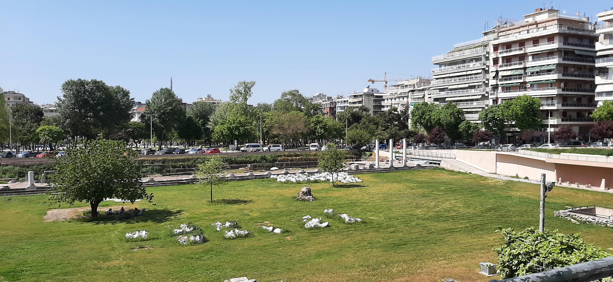
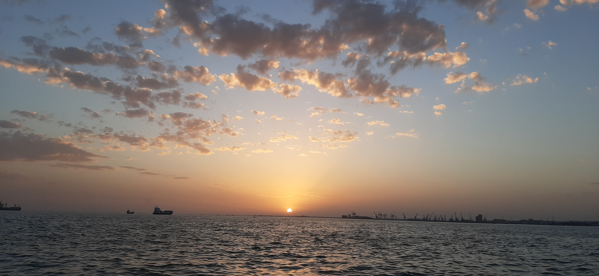

# Things to do in Thessaloniki
# Things to do in Thessaloniki

*Aerial view of Thessaloniki in 2006, Wikimedia Commons*

## An introduction
Welcome to Thessaloniki, the city I grew up in! I won't bother you much with the city's rich history, all you need to know is that it was founded by Greeks, built by Romans, became a seat of power under the Ottoman rule, and a major trade hub thanks to its Jewish population. As a visitor, pretty much all you want to do and see is grouped up within a triangle of 3 points: The White Tower, the old port, and the "Yedi Koule" castle atop the city's hill. The city's main square is the "Aristotelous" square (yes, named after that Aristotle) and there is a tourist [kiosk there](https://goo.gl/maps/G2dHngceEwR61W9i9). The city's other, equally main square is "Navarinou", which is located closer to the university and has a bit of a counter-culture vibe to it. You can walk any of the sides of this triangle in 30-45 minutes. The average food quality is super good, and eating/drinking is much cheaper compared to North Europe, due to the minimum wage being 550€. Most archaeological sites are free, or with fairly low prices and there's ancient stuff just about everywhere, so if you see a street corner with an exposed Roman castle segment embedded in it, don't worry, we know.

**Important:** Please pay attention to this possible faux-pas. Alexander the Great came from this part of the world. He and his people were called "Macedonians". "Macedonia" is also the name that many people used for a small country to the north of Greece until 2018, and there was a bunch of political and ethnic drama between the two countries, because this region of Greece was also called "Macedonia". That drama is now over - the country to the north is now officially named "North Macedonia" and Greece fully recognises that name. If anyone mentions "Macedonia", know that they are referring to this region of Greece, not any other country.

## Things you have to visit

#### "Lefkos Pirgos" (White Tower) 
This is the iconic landmark of the city, located by the seaside. You can visit it inside and get on top. From it, you can walk by the sea towards the old port (west, close), or towards the Music hall (east, very far). 

*Destinygreece, [CC BY-SA 4.0](https://creativecommons.org/licenses/by-sa/4.0), via [Wikimedia Commons](https://commons.wikimedia.org/wiki/File:Lefkos_pyrgos_1.jpg)
[

#### Trigonio tower
Located on the upper part of the city's hills, it has an incredible view over the city. The uphill walk can be a pain - I recommend taking a taxi, or the "50" bus from the white tower for your way up, then walking down.

There are many more options of places to visit based on your priorities, these are just the absolutely basic ones. Google and TripAdvisor are your friends for more. I've also included a section later.

## Things you have to eat
This section is kinda big, because food is good and Greeks do it pretty well. Sorry!

#### Bougatsa
Bougatsa is a kind of breakfast snack that comes in a salty (cheese) and sweet (cream) version. It's crunchy on the outside and soft inside. Try both! There are alternative flavours, but they are worse in my opinion. My recommendations would be [Giannis](https://goo.gl/maps/P8FzyvUYbbKmT2hy6) (near the white tower), but just about any breakfast store you try will have some pretty decent one. Careful, as the inside can be surprisingly hot!

*Cream Bougatsa by greece-is.com*

#### Pita
Pita is a Greek fast food wrap similar to durum or tortillas (but better). You will always get "Pita something" where the something is the protein ("gyros" pork or chicken meat, "souvlaki" pork or chicken skewers, "haloumi" cheese). Besides that, it includes fries, something saladish (usually lettuce, tomato, and onion), and a sauce. You can of course add and remove things as desired! For souvlaki, I would recommend the legendary [Derlicatessen](https://goo.gl/maps/phFryfGGUWLtgVSz7). It's always packed, so consider getting takeaway if you go in a busy time. A nearby sit-in alternative is [Giok Balik](https://goo.gl/maps/4H7owNJ16GzCdtvNA) and there is also [Savvikos](https://goo.gl/maps/4H7owNJ16GzCdtvNA) in Aristotelous square. It's quite an art to eat this food and remain clean - grab napkins!

*Pita Gyros by Jojo Yuen (sharemyfoodd) on Unsplash*

#### Food in any good tavern! 
* Keep in mind that what foreigners call "Greek salad" in greek is called "Village salad". Some menus will have that name. 
* You should definitely order "feta" - a salty cheese that Greeks accompany all their meals with. 
* Consider also "tzatziki", a yogurt-based sauce with cucumber and garlic, tasty yet infamous for making you "unkissable" due to the smell of your breath afterwards. 
My recommendation is ["Takadum"](https://goo.gl/maps/9BkFZvjgULmdwziz7), a tavern within the old Jewish quarters of Thessaloniki that has a lot of space inside so you will always find a table!

*Takadum by Dimitrios Avgeris*

#### The obligatory moussaka
One of the most recognisable greek foods internationally, moussaka is a multi-layer oven dish which includes aubergines, potatoes, minced meat, and a bechamel sauce. Sounds like a confusing mess? Well, most people absolutely love it. I'm not one of them but hey, you do you. Greeks consume moussaka much less than tourists, so the best places to get moussaka are in "Ladadika" the slightly touristic restaurant and tavern area above the old port. Here's a [link](https://goo.gl/maps/pvYGyeyfM5FTYUR8A).

#### Tsoureki
Tsoureki is a kind of cake, traditionally made around the Orthodox holiday of Easter. It can be covered in various types of frosting. A place called "Terkenlis", made a name for itself for selling the best tsoureki in the city, and grew into one of the symbols of the city - as Thessalonikians would often bring tsoureki from Terkenlis when visiting friends and family in other cities. Allegedly, Terkenlis (the owner) would make the employees turn on the ventilation in the underground kitchen, right as Church mass ended on Sunday morning, to hit the passersby with the smell of baking and entice them to the store. You can find the place in Aristotelous and determine for yourself if it's worth it.

*Tsoureki image from terkenlis.com*

#### As a Vegetarian
Being a veggie in Greece is actually super easy! Meat has traditionally not been super prominent in greek culture and Greeks were generally poor for most of history after the year 0, so most of dishes are vegetarian. In "slow food" most of the restaurant/tavern menu will work for you. In fast food, you will probably use "Haloumi", a grilled cheese that is often used as an alternative for meet.

#### As a Vegan
Being a vegan in the city is trickier. There have been quite a few places opening up in the city in the last few years, intensifying from 2020 onwards. Some burger places will have vegan options, but most other fast-food places will not. My recommendation there is [Roots](https://goo.gl/maps/ALrKpVs4d24dNzAi8), which is placed near the city's main street market.

## Things you have to know
* Taxis are fairly cheap and ridesharing (Uber, Lyft, etc) is almost nonexistent
* Card usage is still the minority - always keep some cash available, especially for taxis!
* People generally speak decent English, but with an accent
* Water bottles of 0.5L are mandated by law to cost 0.5€. People try to sidestep this by offering bottles of 0.6 or 0.75, but they are also forced by law to have 0.5L in stock.
* In any place that serves food or drinks, you can ask for unlimited glasses of tap water, for free. This is a legal requirement. There is no faux-pas around this, most people ask for it. If they bring you a sealed bottle, it's because you are a tourist, so kindly let them know you want a glass of tap water. Some places will provide cold water, in pots, still free.
* Greeks generally tend to eat and go out fairly late for European standards. Lunch is around 13-15  and people go out for bars/dinner starting around 21-ish. Bars will fill up around 23-02, while clubs around 1-4. Even later in the summer. Plan accordingly!
* Greeks have something similar to the Spanish/Mexican "siesta". Many places are closed between 14:00 and 17:00.
* Public transport only has buses. You can get tickets in kiosks, or inside the bus (but the bus machine only takes coins and doesn't give change). A metro line has been under construction for ~30 years.
* Consider tipping if you can afford it. Most service folks are wildly underpaid, often below minimum wage. 5% would be standard, 10% would be very nice in most taverns/restaurants.

*Ancient Roman Forum by yours truly*

## Places to consider visiting
Here's a selection of places you can choose from, based on where you will stay and what you feel like.
* Rotunda: Temple converted to church converted to mosque then to museum. The only remaining minaret tower in Thessaloniki. Right above Navarinou square.
* Ancient Roman Forum: Theatre, catacombs and ancient baths. Not very busy most days. Urban legend says that the pillars are fake and were made by archaeologists trying to rescue the area from being turned into a parking. Right on top of Aristotelous square.
* Old Port: This really cool area has been converted from its previous use as industrial port. Photography and cinema museums are there. The space is public, you just walk in. Close to Aristotelous and Ladadika.
* Saint Dimitrios Church: One of the biggest churches in Thessaloniki, and certainly the most important one, since Dimitrios is the patron saint of the city. Visit if you want an idea of what a modern Orthodox church looks like from the inside.
* Archaeological museum: If you're into that sort of stuff, it's honestly really good.
* OTE Tower: Every Thessalonikian has been here once as a kid, and then never again. This communications tower has a rotating top segment and you can sit in its fancy cafe/bar. Might have to reserve though.
* Tsinari: The oldest surviving tavern in the city, perched right on the edge of the old town. A sign in front of the tavern advertises its age - each year that passes the age grows by 2.
* Zithos: An old tavern turned to a restaurant. They have a bunch of awards but their prices are still pretty normal. 2 locations - one in Ladadika and one near the White Tower.
* Cookie Man: You will smell this place before you see it. Probably some of the best cookies you've had in your life. You'll find it near the "Agia Sophia" church.

Much of the above in visual form: [here's this map I made for couchsurfers](https://www.google.com/maps/d/edit?hl=en&mid=1UgZwGZ46QFlyQZgDTynFN1zoTsM&ll=40.623543134003505,22.948733600000004&z=14).

Outside of Thessaloniki, but somewhat nearby:
* in Vergina are the graves of Macedonian kings, including Philip, Alexander's father
* in Chalkidiki are the best beaches you can find in Greece (as any Thessalonikian will readily tell you)

*Thessaloniki sunset by yours truly*

Thanks for reading this, and feel free to reach out for any further questions!

