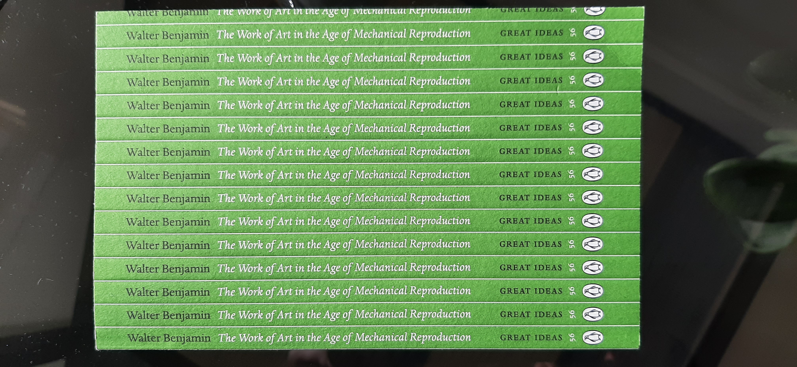
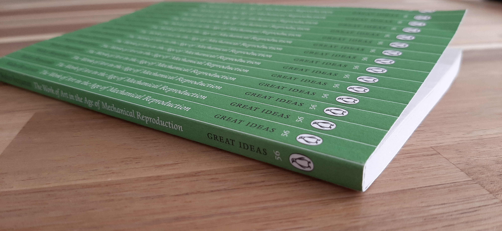

"The Work of Art in the age of Mechanical Reproduction" is a book that was recommended to me by a friend. The cover is so good, that I have to show you:

So, let's talk about this book.

## Introduction
Walter writes this essay in 1935, which he perceives as a pivotal moment. He notices that the means of art production are now available to the masses, and that art can also be created for, as well as consumed by, the masses. Art has finally broken away from the closed halls of aristocracy, yet a novel and fair perception of it struggles to be born. 

## Interesting concepts

#### Aurae
As early as page 5, Walter introduces what is, in my opinion, the most interesting concept in the book. Let him take it away:

>Even with the most perfect reproduction, *one thing* stands out: the here and now of the work of art - its unique existence in the place where it is at the moment.

He proceeds to name this concept the "aura" of the object. The aura includes:
* "The changes it has undergone in its physical structure over the course of time"
* "the fluctuating conditions of ownership through which it may have passed"

The aura is tightly connected to the perception of "genuineness". To me it also very much sounds like the concept of "provenance", as described in "[The colour of bits](https://ansuz.sooke.bc.ca/entry/23)".

The reproduction process not only fails to reproduce the aura, it also diminishes the perception of "genuineness" in the original. A different writer would certainly have spent some words lamenting these loses - but instead, Walter frames this as an exchange. We exchange the aura of the artwork, for the opportunity to have the replica reach further, and to be perceived in unique and novel ways. 

Nowhere is the separation of the performer's aura more visible, than when contrasting classical theatre with film. Theatre is a performance very tightly connected with the here and now, from the reverberations of sounds across the concert halls, to your choice on which actor should be the focus of your gaze

#### Art for the masses
Walter also has some thoughts about how technological reproduction enables the masses to connect with art on a completely new level. 

Paintings, he argues were nearly always meant for a single person to enjoy for much of history. Attending a theatre or opera was rooted in upper-class privilege. But cinemas are affordable and museums are becoming more commonplace (*at his time*). The aura of the original actor is lost when the film plays in a cinema, but a different aura emerges: That of a group of people collectively experiencing the same work of art, influencing each other on the way. 

Walter notes with concern, that one of the most creative users of this new art for the masses is Fascism, using this new popular art in novel and terrifying ways. But Fascism uses art to maintain the status quo and the imbalanced distribution of resources, while we should be using this art to uproot the status quo (*and bring on the glorious revolution*).

>"Communism's reply is to politicize art"