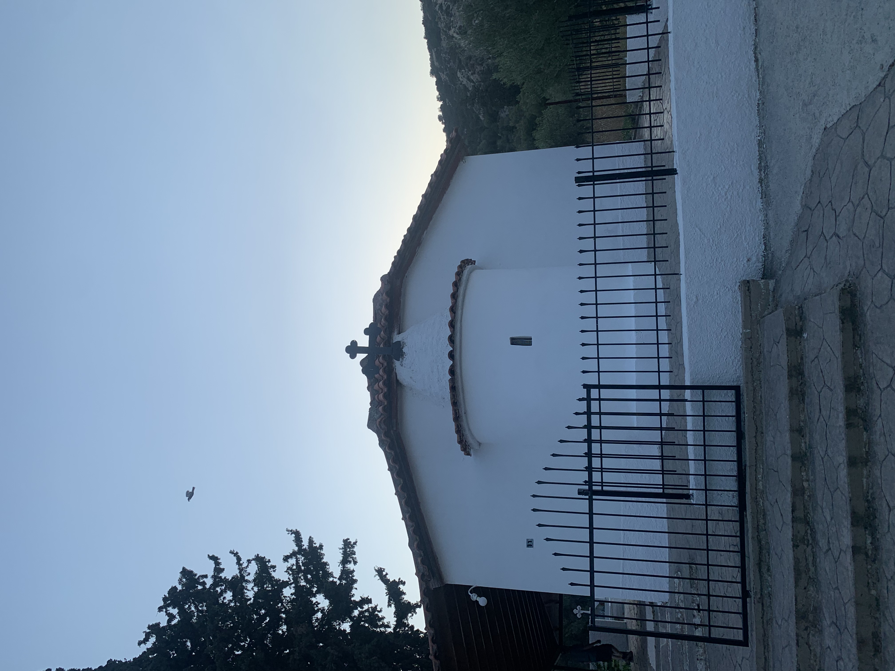

As per [Eleftheria Panousi Koufidou](Eleftheria%20Panousi%20Koufidou.md), the village was first created by a few workers who came from [Velina](https://goo.gl/maps/gUdGjY6UYazQykX57), from higher up in the mountains.

After they worked there for a bit, mainly on olives, olive oil, and raisins, they brought their families. She remembers the Panousi, Lambropoulos families among those.

The village had two neighbourhoods, the low and the high one. They are split by a stream that cuts through them. The low one is 5-10 houses, the high one was around 5. Both of them are destroyed now.

The buildings are made of “lefkohoma”, white soil. This is a soft form of soil found in the area, especially visible by the road. This forms a sort of clay, but it’s still quite soft, so the villages mixed straw in to strengthen it.

There is a church and graveyard in the village. Originally this was part of the Panousi family estate, but it was gifted to make a graveyard. The local families helped to construct the church, and buried their dead there. [Dimitra Lambropoulou Panousi](Dimitra%20Lambropoulou%20Panousi.md) is buried there, alongside [Giorgis Panousis](Giorgis%20Panousis.md). Over time, this graveyard has been used to bury some of the “non-local” dead, especially during the Covid pandemic.

